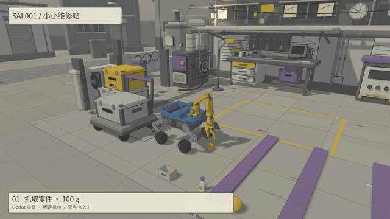
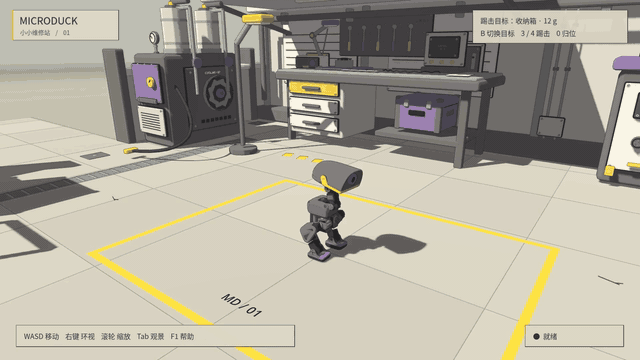
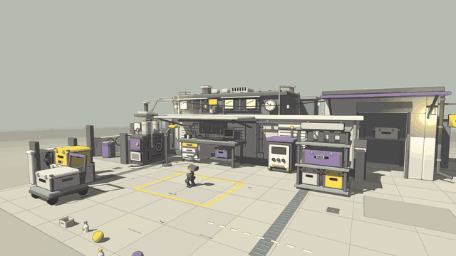

# Robot Godot Sim2Sim

将 MuJoCo 训练的机器人控制策略迁移到 **Godot / Jolt**，运行真实刚体物理与策略控制。支持 MicroDuck、MD 轮滑版和 Sai Robot 001，三种机器人可在同一游戏窗口中动态切换。


[15 秒 PV](docs/science-station/media/sai-windpass-15s.mp4) · [运行说明](docs/science-station.md)


**Sai Robot 001 · 小小维修站**



[15 秒 PV](docs/media/sai-workshop-15s.mp4) · [运行说明](docs/workshop-hub.md)

准备好模型和原生库后，先执行一次 `./run-workshop.sh --prepare-only`，以后用 `./run-native.sh --choose-scene` 直接进入游戏。**F5 / F6 / F7** 切换机器人；Sai 驾驶、下蹲、上下阶、场景物体抓取入仓和 cargo18/cargo25 均在 Godot 进程内运行，不需要 Python/TCP 服务。Python/MuJoCo 只保留为显式参考 oracle。完整说明见 [Sai 本地控制](docs/sai-native-control.md) 与 [维修站运行说明](docs/workshop-hub.md)。

## 功能

- 从编译后的 MuJoCo 模型生成 Godot 刚体、碰撞和关节。
- 运行 ONNX 策略，同步推进 MuJoCo 与 Jolt，采集并对比轨迹。
- 支持 Godot / Jolt 环境中的 PPO 微调与策略评估。
- 支持站立、行走、踢碰、翻滚、轮足动作和 Sai 机械臂抓取入仓。
- 在同一窗口切换三种机器人，并保留场景物件的物理状态。

<details>
<summary>完整技能与场景演示</summary>

**技能演示**


**行走与跟随视角**


**轻质刚体交互**



**Godot 场景**



</details>

## 快速开始

需要 Python 3.12、[uv](https://docs.astral.sh/uv/)、Godot 4.7.2，以及 [microduck_rl](https://github.com/pollen-robotics/microduck_rl) 的机器人资源和 ONNX 权重。

```bash
git clone https://github.com/sgyli7/Robot_Godot_Sim2Sim.git
cd Robot_Godot_Sim2Sim
uv sync

export MICRODUCK_RL=/path/to/microduck_rl
export MICRODUCK_POLICIES=/path/to/onnx_models
export GODOT=/path/to/godot

uv run --no-sync python -m sim2sim.research.setup scenes
uv run --no-sync sim2sim-play
```

机器人网格与模型权重需单独准备。资源配置和模型加载见[运行说明](REPRODUCING.md)。

## 文档

- [物理映射、校准与双后端对比](SIM2SIM.md)
- [环境配置、模型加载与复现](REPRODUCING.md)
- [实验结果](RESEARCH_RESULT_20260910.md)
- [Godot 交互场景](docs/showcase.md)
- [Sai 001 本地 ONNX 控制、模型哈希与验收](docs/sai-native-control.md)

## 许可

原创代码采用 [Apache-2.0](LICENSE)。第三方软件、机器人资源及其许可见 [NOTICE](NOTICE)。
