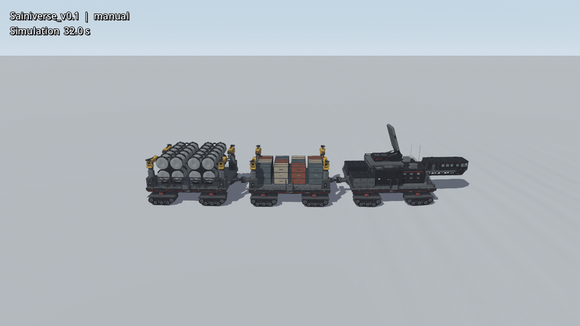
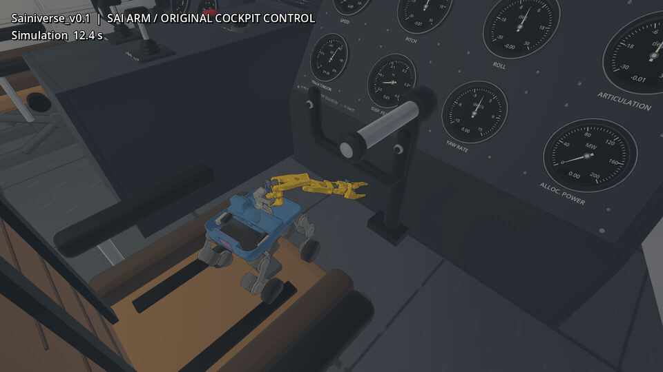
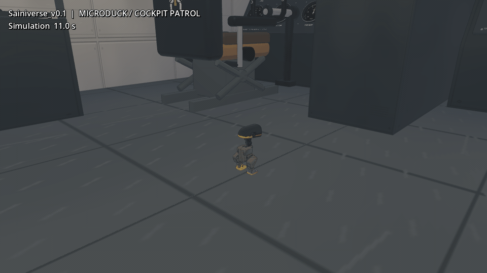

# Robot Godot Sim2Sim

## 03 · 极地雪原 / Sainiverse v0.1



[全车 10 秒 MP4](docs/media/sainiverse-polar-panorama.mp4) · [四机位截图与录制说明](docs/sainiverse-polar-pv.md)

**Sai Robot 001 乘升降台登船**


**Sai Robot 001 用机械臂接触原有驾驶舱控制器**



**普通 MicroDuck 巡视驾驶舱**



这些画面来自 Godot/Jolt 实录。驾驶舱短片使用机械臂阻抗控制和脚本指定的手部目标，机械手接触原有方向舵辐条并使其轻微转动；此前附加的黄色握柄已移除，Sainiverse 本体结构未改。登船片段按阶段选帧，升降过程压缩了播放时间。全景 PV 的四个镜头均保留整车，没有穿入车体。

桌面入口的 03 场景现在进入 **Sainiverse v0.1** 雪原试车场；01 风口科学站和 02 小小维修站仍走原有场景。也可从本目录执行 `./run-native.sh --scene polar_range` 直达 03，或执行 `./run-sainiverse-v0.1.sh --terrain polar`。W/S 驾驶、A/D 转向、空格制动；停车后用 F5/F6/F7/F8 在车旁雪地切换普通 MicroDuck、轮滑版、Sai 001、Sai 002，F9 返回母车。切换机器人后，左侧面板显示对应的移动按钮和操作提示；F1 到车旁雪地、F2 到甲板、F3 到驾驶舱。鼠标或左侧面板可控制视角、主题与作业机构。时间流速滑条默认为 1.0×，范围 0.1×～3.0×。

新车采用独立的 [Sainiverse 设计交付包](https://github.com/sgyli7/Sai_Art)和游戏运行目录。启动器优先使用同级 `Sai_Art` 检出目录，缺失时回退到原来的 `/home/ethan/Projects/RobotDesign/delivery/Sai_Design`；其他路径可设置 `SAINIVERSE_RELEASE_ROOT`。Sai 002 模型来自 [Sai_Rotbots](https://github.com/sgyli7/Sai_Rotbots)，可用 `SAI_ROBOTS_ROOT` 指定其检出目录。按[首次准备](docs/workshop-hub.md#首次准备)安装机器人资源后，启动器会同步四个型号的控制器和模型。独立演示入口：`--mode cockpit_patrol`、`--mode sai_cockpit`、`--mode sai_board`、`--mode sai_board_002`、`--mode deck_patrol`。母车交互预览使用 60 Hz；MicroDuck 演示先以 60 Hz 停车准备，出生后恢复已验证的 200 Hz；Sai 演示以 100 Hz 停车准备，出生后保持 1000 Hz。直接把机器人降到约 50 Hz 的试验分别出现跌倒和非有限刚体位姿，Sai 001 在 60 Hz 停车准备的完整登车测试也失败，因此不能用单一 60 Hz 物理频率替代现有控制。旧 Leviathan 001 仍可从 03 场景的车型选择框进入，说明见[原版集成文档](docs/leviathan-integration.md)。

将 MuJoCo 训练的机器人控制策略迁移到 **Godot / Jolt**，运行真实刚体物理与策略控制。03 场景支持 MicroDuck、MD 轮滑版、Sai Robot 001 和 Sai Robot 002，在同一游戏窗口中动态切换。


[15 秒 PV](docs/science-station/media/sai-windpass-15s.mp4) · [运行说明](docs/science-station.md)


**Sai Robot 001 · 小小维修站**


[15 秒 PV](docs/media/sai-workshop-15s.mp4) · [运行说明](docs/workshop-hub.md)

准备好模型和原生库后，先执行一次 `./run-workshop.sh --prepare-only`，以后用 `./run-native.sh --choose-scene` 直接进入游戏。**F5 / F6 / F7** 切换机器人；Sai 驾驶、下蹲、上下阶、场景物体抓取入仓和 cargo18/cargo25 均在 Godot 进程内运行，不需要 Python/TCP 服务。Python/MuJoCo 只保留为显式参考 oracle。完整说明见 [Sai 本地控制](docs/sai-native-control.md) 与 [维修站运行说明](docs/workshop-hub.md)。

## 功能

- 从编译后的 MuJoCo 模型生成 Godot 刚体、碰撞和关节。
- 运行 ONNX 策略，同步推进 MuJoCo 与 Jolt，采集并对比轨迹。
- 支持 Godot / Jolt 环境中的 PPO 微调与策略评估。
- 支持站立、行走、踢碰、翻滚、轮足动作和 Sai 机械臂抓取入仓。
- 在同一窗口切换三种机器人，并保留场景物件的物理状态。

<details>
<summary>完整技能与场景演示</summary>

**技能演示**


**行走与跟随视角**


**轻质刚体交互**


**Godot 场景**


</details>

## 快速开始

需要 Python 3.12、[uv](https://docs.astral.sh/uv/)、Godot 4.7.2，以及 [microduck_rl](https://github.com/pollen-robotics/microduck_rl) 的机器人资源和 ONNX 权重。

```bash
git clone https://github.com/sgyli7/Sai_Lab.git
cd Sai_Lab/Godot_Sim2Sim
uv sync

export MICRODUCK_RL=/path/to/microduck_rl
export MICRODUCK_POLICIES=/path/to/onnx_models
export GODOT=/path/to/godot

uv run --no-sync python -m sim2sim.research.setup scenes
uv run --no-sync sim2sim-play
```

机器人网格与模型权重需单独准备。资源配置和模型加载见[运行说明](REPRODUCING.md)。

## 文档

- [物理映射、校准与双后端对比](SIM2SIM.md)
- [环境配置、模型加载与复现](REPRODUCING.md)
- [实验结果](RESEARCH_RESULT_20260910.md)
- [Godot 交互场景](docs/showcase.md)
- [Sai 001 本地 ONNX 控制、模型哈希与验收](docs/sai-native-control.md)

## 许可

原创代码采用 [Apache-2.0](LICENSE)。第三方软件、机器人资源及其许可见 [NOTICE](NOTICE)。
