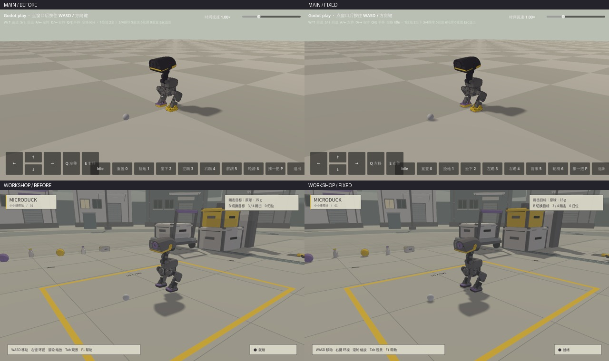
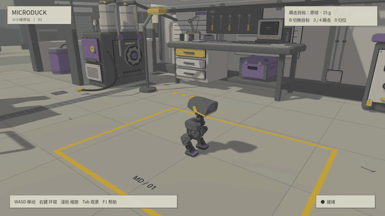

# Contact shadows

The default directional `shadow_bias=0.1` detached shadows from the 25 cm MicroDuck and erased shadows beneath small props in Forward+. The visible MicroDuck style and workshop now use `0.005`; normal bias, lights, camera, meshes and physics remain unchanged. The style is skipped by headless workers.

This is the shadow-map separation described in [Godot's Light3D documentation](https://docs.godotengine.org/en/4.6/classes/class_light3d.html#class-light3d-property-shadow-bias). Lowering normal bias alone did not fix the Forward+ reproduction.



The render regression uses the actual main and workshop scripts, a settled native policy pose, and a 30 mm sphere touching the ground. It compares the current setting with the historical bias without moving the casters. Both soles were within 0.14 mm of the physical floor. In Forward+, shadow contrast 5 mm from the sphere contact changed from zero to 49–52 grayscale levels; OpenGL retained its contact shadows.

```bash
source scripts/showcase_env.sh
.venv/bin/python scripts/validate_contact_shadows.py --renderer vulkan --scene main
.venv/bin/python scripts/validate_contact_shadows.py --renderer vulkan --scene workshop
.venv/bin/python scripts/validate_contact_shadows.py --renderer opengl3 --scene main
.venv/bin/python scripts/validate_contact_shadows.py --renderer opengl3 --scene workshop
.venv/bin/python scripts/verify_workshop_isolation.py
```

Godot 4.7.2 on NVIDIA GB10: all four render checks passed. A 100-step standing rollout was numerically identical in main, workshop and flat modes. Native walking, a full camera orbit and zoom were captured on both renderers; inspected frames showed grounded support feet and no new visible shadow acne. OpenGL retains its pre-existing two texture-release diagnostics at exit; Forward+ logged no errors.



The motion preview includes the local district scenery. Its first frame and camera are not a fixed gameplay view. Raw captures are kept under `results/contact_shadows/` and `results/district/shadow-fixed-*`; compact measurements and media hashes are in [validation data](contact-shadow-validation.json).
