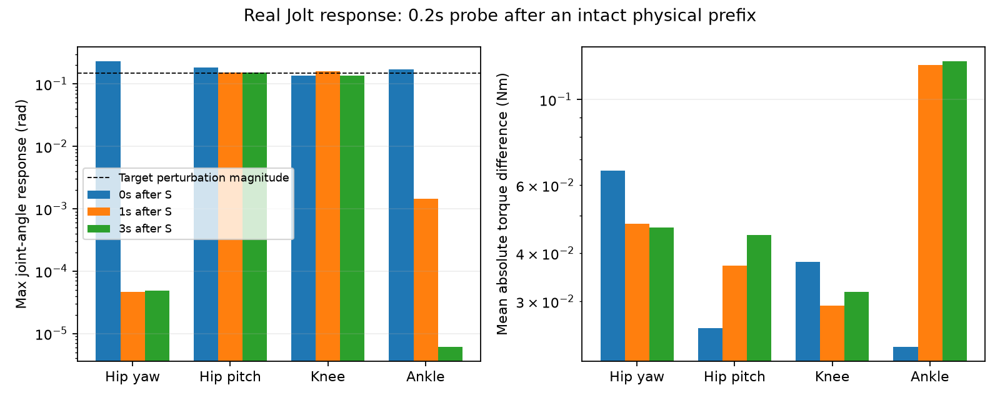

# Jolt 任务学习的阶段证据

## R0 已完成

同一冻结反馈锚点、同一 61 维演员、每次 262,144 样本，三个配对训练随机种子：

| 目标 | 71 | 72 | 73 | 相对旧候选 |
|---|---:|---:|---:|---|
| 不训练，冻结反馈候选 | 51/56 | 51/56 | 51/56 | 固定开发集基线 |
| 原 legacy 目标 | 43/56 | 50/56 | 47/56 | 均有旧成功回退 |
| command_heading_v1 | 41/56 | 44/56 | 41/56 | 均有旧成功回退 |

这六个终点均不替换模型。它们均未新增跌倒，退步主要体现为停稳确认超过两秒，少量发生持续倒滑。方向目标的一步逻辑冲突已被真实边界回归证明，但修正该项不足以产生性能改善。这不证明更充分训练下该目标永远无效。

[逐项结果](R0_ANALYSIS.JSON) · [两条物理轨迹对照](r0_braking_traces.png)

## 训练与游戏控制一致性

新 68 维输入在两条完整 Jolt 回放（W1、转向制动，种子 917000）上，训练 `World` 与独立应用的命令、观测和动作最大差异约 5.33e-15。原生模型的 Python shadow 另覆盖了蹲起后制动。这里的证据覆盖具体回放，不泛化成所有状态下的动力学等价证明。

[逐步训练／原生对照](TRAINING_NATIVE_CONTRACT.JSON)

## 动作表达审计

旧反馈候选在 56 条主动制动开发回放中，两侧 hip_yaw 约 99%、ankle 约 98% 的制动帧请求了超出模型关节范围的目标角。该事实描述控制目标，不表示修改了关节限制，也不等同于实际关节超过限制。Jolt 驱动依旧计算有电流上限的 PD 力矩，然后施加原有阻尼／摩擦。

已完成两个种子、三个到达时刻的真实 Jolt ±0.15 rad 对照，扰动后继续运行 0.2 秒，始终保留完整物理前缀。刹车启动时四个被测关节均有明显响应；在近停／保持阶段，髋转向和踝角度响应显著缩小，力矩却仍改变，髋俯仰和膝关节仍保留位置响应。因此“目标角残差”的物理作用会随阶段改变，不能当成各关节同等有效的位置动作。单关节局部试验不证明其他耦合方向无效。

详细原始数字见 [ACTION_RESPONSE.json](ACTION_RESPONSE.json)。据此登记 R2 受限关节试验，尚不宣称该限制有效。

[目标范围统计](BASELINE_ACTION_AUTHORITY.JSON)

## R1 已完成：短训练没有显示稳定状态收益

| 68D 同结构、同 critic、同 stop_hold_v1 目标 | 71 | 72 | 73 |
|---|---:|---:|---:|
| 屏蔽七个新 actor 输入 | 34/56 | 47/56 | 38/56 |
| 完整七个新 actor 输入 | 37/56 | 46/56 | 37/56 |

两个组都未超过 51/56 的冻结候选，组间收益不稳定。这一结论只覆盖当前目标、控制表达、课程及 262,144 样本预算，不能推断状态历史对所有训练路线无用。已登记的百万样本对照继续检验完整状态与两种动作权限。详见 [R1_ANALYSIS.json](R1_ANALYSIS.json)。

## 工程验证

240 项单元／集成测试通过，其中 2 项为原有可选跳过。新 68D 零增量工程包在 Ubuntu 24.04 ARM64 禁网、无 Python／训练仓库环境通过九模型数值自检和 23 条回放；这些回放的动作与旧包完全一致。另一个 25 秒回放覆盖两次复位、两次机器人切换和蹲起，Python shadow 通过。宿主当前锁屏，未执行全局键盘注入，因此这些检查不称作本轮真实键盘验收。

零增量工程包只验证可部署性，不是学习成果；其中数值自检为随机／边界输入，真实状态覆盖来自上述回放对照。最终如选出模型，须用冻结模型的真实观测重建正式夹具。

[导出执行](EXPORT_CHECK.json) · [旧动作保留](EXPORT_PRESERVATION.json) · [复位／切换](RESET_SWITCH_PARITY.json)

## R2 短训练：限制位置动作方向没有改善

三个 262,144 样本终点分别为 19、34、27/56，均低于同种子 R1 full 和冻结基线。因此不能因为某关节的角度响应小就移除其学习权限；受限输出同时改变了力矩调节、探索分布及每个可调方向分到的 KL 预算。局部响应审计是诊断证据，不是这种动作限制正确的证明。预先登记的 1M 对照继续执行。

教师保留模块的新增检查后，全套 243 项测试通过（2 项原有可选跳过），实际 32 样本训练及 32 样本续训 smoke 通过。这两个小运行不参与模型质量结论。

## 已登记的百万样本追加完成

| 方案，累计 1,048,576 样本 | 71 | 72 | 73 |
|---|---:|---:|---:|
| R1 完整任务状态 | 32/56 | 36/56 | 30/56 |
| R2 受限关节 | 2/56 | 0/56 | 0/56 |

六个终点均低于对应 262k 终点及 51/56 的冻结基线。R1 的种子 71 还新增一条转向后制动跌倒。当前这些固定目标、控制表达和 PPO 设置没有因四倍累计样本而改善；这不等价于所有 PPO 或所有任务状态方案无效。六个终点均保留巡航速度门槛，但仍因成功丢失被拒绝，不能用巡航没退步抵消制动退步。

完整记录见 [追加试验](EXTENSION_RUNS.json)。均值／探索噪声、真实回放回报重算和物理指纹核查见 [退化诊断](DIAGNOSTICS.md)。

## R3 完成：教师保留减少退化，只有一个微弱改善终点

| 累计 1,048,576 样本 | 71 | 72 | 73 | 旧成功回退条数 |
|---|---:|---:|---:|---|
| 当前状态教师 KL | 50/56 | 50/56 | 50/56 | 1、1、1 |
| 成功教师回放 KL | 51/56 | 52/56 | 52/56 | 0、1、0 |

六个终点均无制动跌倒，巡航门槛保留。成功回放种子 72 虽然总通过数增加，但丢失一个旧成功，因此不晋级；种子 73 增加一个 W1 成功、没有旧成功丢失，是唯一冻结进入新保留集的候选。它在开发集仍有四条主动制动未达标，不能称作成功交付或实质性跨域突破。R3 相对不带教师项的 R1 退化明显减轻，支持进一步研究成功行为保留；三个种子不足以证明算法普遍有效。

所有 27 个正式质量终点及 14,942,208 个去重 PPO 转移已完成；[逐项数据](TRIALS.json)、[来源校验](EVIDENCE_MANIFEST.json)、[教师试验记录](R3_RUNS.json)。最终保留集结论另见最终报告。

