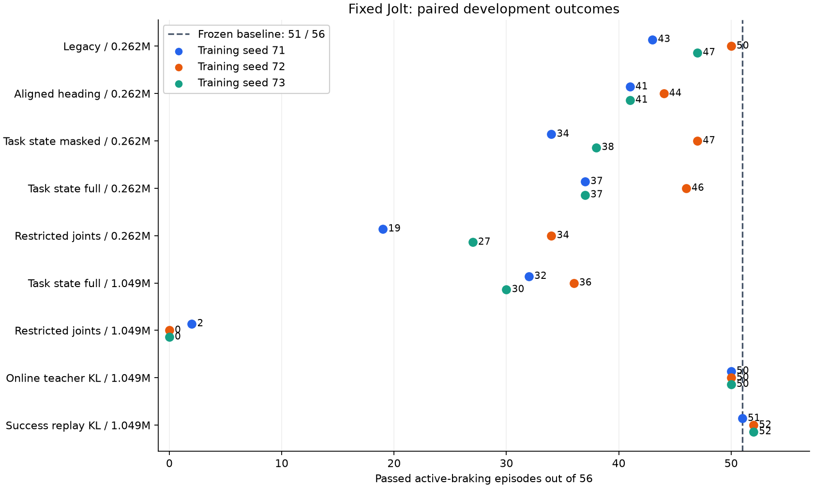

# 固定 Jolt 的新训练路线：最终记录

**没有得到可替换旧模型的质量改善。** 唯一开发集候选在最终保留集仍是 **183/210**，与旧反馈候选持平，并丢失 5 个旧成功用例（另新增 5 个成功）。两者主动制动均零跌倒，候选保留巡航速度，但失败门槛没有降低；候选被拒绝，旧模型和旧包保持原样。

本轮从已保存的反馈候选出发，运行时始终为 Godot/Jolt，物理、质量、碰撞、重力、执行器与 200/50 Hz 频率未改。开始试验前已提交当前效果 `26a4e67`；本轮是路线验证，主要训练轮滑，其余八技能沿用旧模型参加回归，没有声称重新优化了九项。

## 模型与训练结论

27 个预先登记的物理终点、三个训练随机种子、共 14,942,208 个去重 PPO 转移已完成。相比固定开发集 51/56：

| 方案 | 三个训练种子的主动制动成功数 |
|---|---|
| 原 PPO 目标，262k | 43、50、47 / 56 |
| 对齐命令朝向，262k | 41、44、41 / 56 |
| 68D 任务状态屏蔽，262k | 34、47、38 / 56 |
| 68D 完整任务状态，262k → 1M | 37、46、37 → 32、36、30 / 56 |
| 限制学习关节，262k → 1M | 19、34、27 → 2、0、0 / 56 |
| 当前状态教师 KL，1M | 50、50、50 / 56 |
| 成功教师回放 KL，1M | 51、52、52 / 56 |

成功教师回放减少了训练退化。种子 72 虽有 52 条成功，却丢失一个旧成功，因此拒绝；种子 73 的 52/56 没有旧成功回退、没有制动跌倒、巡航保留，是唯一进入新保留集的候选。它在开发集只多通过一条 W1 回放，仍有四条不合格，不能称为全面突破。

新候选 SHA256：`fb196f8d72234aef276e09cdd26560c28c9cef248fa73fd2d714623704ecf466`。冻结后使用全新的 `918000–918029`，旧／新包各 690 条回放，控制、初态及评分相同；没有按最终结果再挑模型或参数。

主动制动共 210 条，候选仍有 **27 条未通过**；主要集中在 W1 推进后的刹车（10/30）。下表中轮滑使用主动制动判据，其他技能使用既有任务判据；行走未在本轮重训，长直行、转弯与反复起步仍明显不足。

| 固定保留集用例 | 旧包 | 冻结候选 |
|---|---:|---:|
| ground_pick | 30/30 | 30/30 |
| kick_left | 30/30 | 30/30 |
| kick_right | 30/30 | 30/30 |
| roller_brake_1s | 10/30 | 10/30 |
| roller_brake_2s | 28/30 | 29/30 |
| roller_brake_3s | 30/30 | 30/30 |
| roller_brake_5s | 30/30 | 29/30 |
| roller_crouch | 30/30 | 30/30 |
| roller_crouch_brake | 28/30 | 28/30 |
| roller_release_3s | 0/30 | 0/30 |
| roller_repeated_brake | 30/30 | 29/30 |
| roller_space_3s | 0/30 | 0/30 |
| roller_turn_brake | 27/30 | 28/30 |
| roulade | 29/30 | 29/30 |
| sitstand | 30/30 | 30/30 |
| standing | 30/30 | 30/30 |
| walking_back | 30/30 | 30/30 |
| walking_forward_long | 2/30 | 2/30 |
| walking_repeated_start | 0/30 | 0/30 |
| walking_strafe | 30/30 | 30/30 |
| walking_straight | 22/30 | 22/30 |
| walking_turn_left | 0/30 | 0/30 |
| walking_turn_right | 0/30 | 0/30 |

松键和空格保留为制动对照，不混入 210 条主动制动成功数。重复制动的一条回放包含三次制动，必须全部通过才算该回放成功。翻滚的有意倒置不混报成新增跌倒。严格配对与逐条失败原因见 [最终数据](FINAL_RESULTS.json) 和 [原始对比](FINAL_COMPARISON.json)。

## 工程与资源

九模型真实观测、随机及边界输入的原生／Python 最大动作误差约 `1.42e-14`，未降低 `1e-5` 门槛。新 68D 任务状态可在原生引擎中产生，模型通过引擎资源加载；独立程序不依赖 Python/TCP。此前的实际训练 World 与原生回放对照、复位和换机器人证据保留，冻结候选的验证见 [验收记录](FINAL_VALIDATION.json)。

首次最终打包因冻结快照的旧 release 扩展拒绝 68D 模型而失败，发生在保留集生成之前。已用此前验证过的 release 文件修复验收工程，模型和物理未改；原失败目录保留。打包器新增实际导出文件自检，避免仅凭编辑器中的 debug 扩展通过就认定 release 包可用。

冻结候选在 Ubuntu 24.04 ARM64、无 Python／训练仓库、禁网环境完成 23 条开发回放，运行错误为零。25 秒复位／换机器人回放的 1,250 个决策在 Python shadow 中通过，最大误差低于 1e-5。该工程命令带曾误送进严格任务评分器，评分器正确拒绝含复位的轨迹；复用同一次原生执行做控制对照，没有改评分器或将复位计入任务成功。

独立包随后完成 **30 个模拟分钟、实际约 260 秒**的连续运行，90,000 次决策、144 次复位及 144 次机器人切换；速度约 6.96 倍实时，进程峰值 RSS 约 220.7 MiB，后半段 RSS 斜率约 0.012 KiB/s。轮滑推理 p50/p95/p99 为 73/109/180 µs，行走为 244/441/602 µs。该检查使用原生 CPU 推理和 headless 固定步长，没有竞争训练／回放任务；它验证加载释放和连续运行，不是 30 分钟真实渲染运行、无复位制动质量或长期无泄漏证明。见 [性能记录](FINAL_RUNTIME_PERFORMANCE.json)。

本轮未重新开展宿主真实键盘、不同渲染帧率和暂停恢复验收，未将工程检查称为完整新版本交付；新的严格制动门槛本身也未通过。

训练器已新增 CUDA 学习：CPU 采集 Jolt 状态及精确 ORT 锚点，GPU 更新演员／critic，完整更新后同步 CPU 采样器。68D 演员内部 float64、critic float32，禁用 TF32，不改变 ONNX 原图。GPU 训练、GPU 续训、旧 CPU checkpoint 迁到 GPU 都通过实际小跑及导出门禁。

**GPU 能运行，但本次没有获得整轮加速。** 固定条件的串行对照中，每轮采样约 5.4 秒；CPU 学习约 0.126 秒，CUDA 学习约 0.196 秒，完整更新分别 5.551／5.678 秒。约 97% 时间在物理采样与逐步编排。单网络微基准在资源争用时测到的十倍差异不能代表训练提速。GPU 动态采样、小算子和同步仍有开销，但减少这部分无法解决主要采样瓶颈。详见 [GPU 与资源报告](GPU_AND_RESOURCES.md)。

新任务默认限制四核、nice 10；Godot 及容器回放继承 CPU 限制。长任务可以通过独立监督进程持续记账、执行超时并在结束时回收本任务进程组。旧监督曾中断，已按 PID 起始时间与连续 checkpoint 恢复实际工时，未将完全停工间隔计入。全套测试 249 项：247 通过，2 项原有可选跳过；验证日志和 SHA 见 [GPU 验证](GPU_VALIDATION.json)。

## 接下来值得做什么

本轮证据支持优先保留成功行为，并反对继续给当前无教师约束的 PPO 配方盲目加样本或限制关节。完整状态、朝向对齐和更长训练没有产生稳定改善；这不证明状态信息、所有 PPO 或所有残差方法无效。固定回放上任务成功率和重新计算的回报一起下降，也不能简单归因于“奖励上涨而任务被钻空子”。

加速方面先细分采样区间中的 Jolt、Python、TCP 与 CPU ORT 开销；当前总计时不能判断哪一项占主导。然后用数值和完整控制回放约束批量采样、进程数量或通信改动，避免更快地采集错误行为。

学习方面先验证演员更新的方向：固定成功／失败前缀与 checkpoint，对照 critic 的优势预测和真实 Jolt 后续回报，判断错误来自值函数、自举时限、访问分布还是动作表达。成功教师数据可作为保留约束及价值校准来源；本轮仅试了同均值 KL，没有检验教师轨迹参考、完整离线策略学习或 FastSAC。

只有在更新方向可验证后，再比较提高样本复用的离策略方法与当前 PPO；若采用 GPU 仿真扩大离线训练量，应另建训练域并持续用冻结 Jolt 的相同命令验收。不能把更高 GPU 利用率、更多样本、较高训练奖励或换掉游戏物理当作模型进步。工业方案／论文的前期调查见 [训练方向研究](../research_20260911_training_direction.md)，本次实测对其中路线的支持范围以上述对照为限。

本轮仍没有完整原版 MuJoCo 九技能的同任务质量基准，因此不能声称达到或超过原版水准；特别是主动限时停稳属于新增闭环能力，抽查的源域原策略也没有满足全部新制动判据。

## 复现、工时与收尾

[协议](PLAN.md)、[阶段证据](FINDINGS.md)、[退化诊断](DIAGNOSTICS.md)、[复现说明](REPRODUCE.md)、[模型／样本校验](EVIDENCE_MANIFEST.json)。原始轨迹、checkpoint、冻结代码和包保存在 `results/jolt_learning_20260911/`，未全部放入 Git。

有效工时账本截至收尾约 **268.6 分钟**，低于本轮 480 分钟上限；并行工作只记区间并集，无未确认空档。查看 [封存账本](ACTIVE_BUDGET.json) 和 [会话状态](SESSION_FINAL.json)。没有为了用满预算继续追加无收益训练。

已核查 21 个本轮进程组及 24 个本轮容器标识：无本轮残留进程或容器，全局 Godot／MicroDuck 运行进程为零，研究 Python 任务也已退出。旧九模型与旧两个安装包 SHA 保持不变；其他项目进程未被终止。见 [收尾审计](CLOSEOUT_AUDIT.json)。

可复查的试验归档为 `dist/MicroDuck-ARM64-20260912-learning-trial.tar.gz`，明确标记未晋级；它包含与验收相同的独立 app、拒绝原因和最终结果，不能代替旧包或称作达标发布。SHA256：`ab8ef4414bce947797b6cf75b08824b342dba193b56257add6e56717db715496`。包／模型清单见 [归档记录](TRIAL_ARCHIVE.json)。

GPU、资源监督和 release 自检修复已提交 `84fd55f`，试验收尾证据另作本地 Git 提交。本轮终止在冻结后的判定，不再用这些最终种子调参；后续需要新会话与新的保留集。
