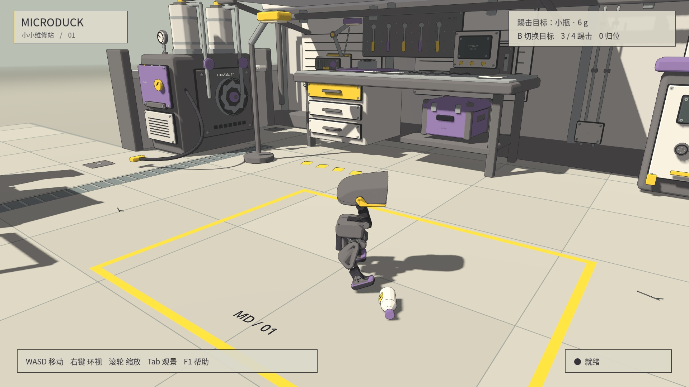

# 轻质量动态物件

维修站默认加入六个 **RigidBody3D**：可被推动、踢走、翻倒的塑料收纳箱、小瓶和小球。
前一版固定台阶保留为可选 `--steps` 模式，不再占用默认试验区；墙体、桌架等固定设施继续保留碰撞。

现有足球的实际质量为 **0.015 kg（15 g）**，从生成机器人刚体读取。
新增物件按它的质量比例配置；没有更改原足球、机器人质量、关节、模型或控制周期。

| 物件 | 质量 | 碰撞结构 |
|---|---:|---|
| 奶白收纳箱 | 12 g | 开口箱，独立底板与四壁 |
| 紫色收纳箱 | 10 g | 同样的空心结构 |
| 小瓶 × 2 | 6 / 8 g | 瓶身、肩部、颈部、瓶盖组成的凸包 |
| 小球 × 2 | 10 / 15 g | 细分凸包，允许自由滚动 |

转动惯量与重心由引擎根据质量、碰撞形状计算，未锁定任何旋转轴；均开启 CCD。
小球的颜色标记随球体转动，便于观察旋转。材质保留 MicroDuck 的奶白、黄色、紫色与石墨灰。
关于自动惯量、重心和 CCD 的定义见 [Godot RigidBody3D 文档](https://docs.godotengine.org/en/stable/classes/class_rigidbody3d.html)。

## 操作

```bash
./scripts/play_atelier.sh          # 固定设施碰撞 + 六个动态小物件
./scripts/play_atelier.sh --roller # 轮足也可以推动这些物件
./scripts/play_atelier.sh --flat   # 历史平地演示
./scripts/play_atelier.sh --steps  # 前一版静态台阶试验区
```

物件初始放在工作台对面的开放区域，可以走过去直接碰撞。
为方便比较踢击，**B** 循环选择原球、箱、瓶与轻球，右上角显示当前物件及质量；再按 **3 / 4** 左右踢击。
选择动态目标时，沿用控制器现有的踢球摆放时机，把所选物件放到脚前，并将原球移出测试区，避免两者重叠。
这次摆放发生在动作开始时，之后完全由 Jolt 解算，不追踪物件、不额外加冲量、不在踢击中扶正。
**0** 同时重置机器人和六个小物件，清零速度并保留所选目标。

物件有独立状态，不混入机器人关节、模型输入输出或原来的 `_bodies` 映射。
它们跟随服务器的物理步进运行：等待控制命令时不会多推进物理；断开／冻结时保存速度，恢复时还原动量。
诊断数据通过已有的计步回复返回，不另外插入物理步。

## 真实运行

[播放 12 秒动态物件演示](https://raw.githubusercontent.com/sgyli7/MicroDuck-Godot-Simi2Sim/main/docs/media/loose-props.mp4)

三个片段展示左踢收纳箱、右踢小瓶、左踢轻球，均为选定 ONNX 策略产生的真实接触。
每个原始运行包含 1 秒站立准备和完整 5 秒技能；成片各取 4 秒，保持实际速度，没有加速或人工姿态动画。



左右踢击各测试箱、瓶、球，共六组固定初态演示，seed 61000。

| 目标 | 技能 | 位移 | 最大姿态差 | 机器人摔倒 |
|---|---|---:|---:|---|
| Bin12g | 左踢 | 6.3 cm | 39.6° | 否 |
| Bottle6g | 左踢 | 6.9 cm | 6.7° | 否 |
| Ball10g | 左踢 | 34.3 cm | 179.3° | 否 |
| Bin12g | 右踢 | 9.1 cm | 54.0° | 否 |
| Bottle6g | 右踢 | 9.6 cm | 140.8° | 否 |
| Ball10g | 右踢 | 51.6 cm | 177.0° | 否 |

姿态差为相对起始姿态的旋转角，不是累计转过的圈数。右踢瓶子相对竖直的最大倾角为 93.4°，确实翻倒。
完整数据见 [验证记录](loose_props_validation.json)。
这些物件都被真实脚部接触并产生运动，机器人均未摔倒；左踢小瓶主要是推移和轻微倾斜，右踢才明显翻倒。
这说明现有策略在这些初态下可以与轻物件交互，不代表已具备任意姿态、任意尺寸物件的稳定踢击能力，也不是跨种子成功率评估。

## 物理检查与发现

- 六个物件落地后可静置，2 秒后的速度低于 0.01 m/s，归位点到静置点的移动小于 5 mm。
- 从箱口向下发射射线，会命中箱底，证明没有用一个实心凸包填满空箱。
- 对真实自由刚体施加同样的 0.0015 N·s 偏心冲量，六者均产生平移和角速度；10 g 球的速度变化约为 15 g 球的 1.5 倍。
- 冻结时物件位置不变，恢复时保留线速度和角速度；正常重置精确归位并清零速度。
- 实际 B 键循环 0→1→2→3→4→5→6→0，重置保留目标选择。
- 原平地、新维修站中央空地、`--flat` 的 100 步站立对照保持一致；新物件的接触区不属于这一等价结论。

**发现并处理的小球问题：** 解析 `SphereShape3D` 在项目保留的 Jolt 设置与大尺寸地面下，会从静置开始逐渐自行滚动。
改变起始落地高度和关闭 CCD 都没有消除这个现象。新增小球改用细分凸包、以支撑面朝下作为初始姿态后，静置检查通过。
这是场景物件的碰撞近似选择，可能改变滚动阻力；没有更改全局求解参数、偷偷加稳定力，或修改原足球。
凸包的静置支持与自动转动惯量同样由 Jolt 解算。

```bash
source scripts/showcase_env.sh
.venv/bin/python scripts/validate_workshop.py
.venv/bin/python scripts/verify_workshop_isolation.py
.venv/bin/python scripts/verify_loose_prop_controls.py
# 真实策略测试；去掉 --headless 可录制画面，输出在 results/loose_props/
.venv/bin/python scripts/capture_loose_props.py --headless --target bottle --skill kick_right
```

所有制作与测试在独立展示工程完成。原 `main.tscn`、训练代码、机器人配置和模型文件未修改。
六个动态刚体会增加展示场景的物理计算量，不宣称零开销；默认仍限制单预览、30 FPS，并沿用训练资源监测。
