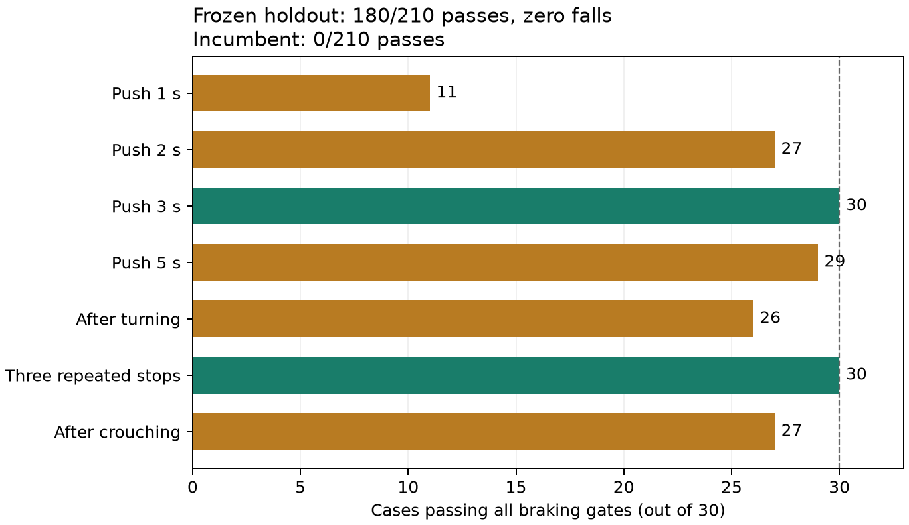
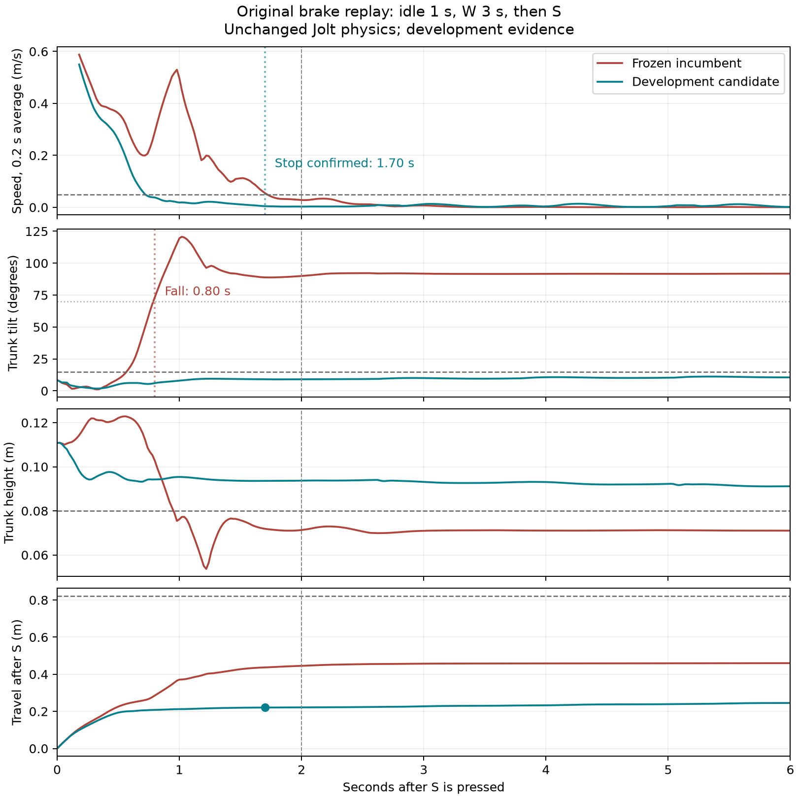
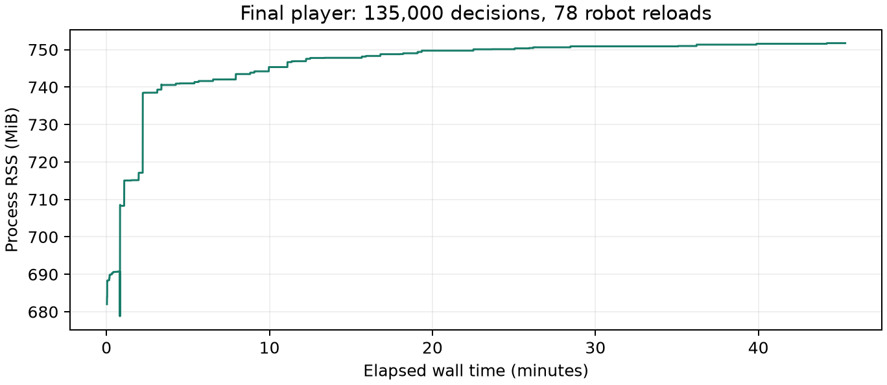

# 九技能独立运行与自动优化：2026-09-11

本轮按 480 分钟实际工作时间上限执行；最后 90 分钟只做冻结候选的验收、交付和阻断问题处理。原生独立运行、数值等价、九技能操作和长期运行验证已经完成。最终轮滑主动制动从 0/210 提升至 180/210，候选零跌倒，但 30 条仍未达标；宿主全局键盘验收也因锁屏未完成。本轮不能宣称全部完成，轮滑候选不覆盖默认模型。

## 已冻结的交付对象

- `dist/MicroDuck-ARM64-20260911-incumbent/`：本轮旧九模型、原控制契约的独立参考包。
- `dist/MicroDuck-ARM64-20260911-candidate/`：同一运行时，八模型保留旧版，轮滑使用实验模型；行走使用单独记录的松键朝向控制。
- 轮滑候选 SHA256：`c2f4229372921e188c09e1a68e56bdd7201dd99d52edef2dd16aa1f654a26e97`。
- 行走控制：`walk_idle_settle_v2`，松键后等待 0.5 秒，朝向增益 6；行走 ONNX 不变。
- 冻结清单：`results/research_20260911/final_freeze.json`。保留种子 916000–916029 在冻结之后生成，各 690 条回放；结果不反馈给本轮参数选择。
- 模型文件、sidecar 和完整 SHA 清单随交付目录保存；Git 保存实现、协议和报告，不保存权重与大体积轨迹。

## 架构判断

把推理移入 Godot 是部署层的改进，可以消除对 Python/TCP 控制服务的运行依赖。它不会自行修复策略在 Jolt 中的动作质量。本轮将同一物理实现、观测、上次动作、技能计时、朝向、目标缩放和输入状态机一起对齐，再分别验证数值等价与任务质量；不能把“原生可启动”当作训练效果。

最终运行路径为 Godot 资源读取 → C++ GDExtension → ONNX Runtime 1.29.0 CPU。保留原 ONNX 节点与内部 DOUBLE 运算，外部接口为 float32 的 61 维观测、14 维动作。物理 200 Hz、策略 50 Hz，原生入口与训练入口共用物理积分和传感刷新。质量、重力、碰撞和执行器物理参数没有调整。

本轮更关键的问题在于训练目标、可观测信息和评测场景是否与操作任务一致。第一轮九项教师约束残差训练均没有提供足以换模的证据：有的奖励或均值上涨，但旧成功配对丢失；有的避免跌倒后仍持续移动。完整键盘回放下的小规模参数搜索提供了更直接的改进证据。它不证明某一种优化器普遍优于 PPO，两者预算与搜索空间不同。

轮滑实验显式声明额外状态：obs[58:61] 为朝向下的 COM 前向速度、侧向速度和躯干高度。原模型通过输入屏蔽继续读取原来的零值，新增制动残差使用这些状态；只有负油门启用残差。固定一个 41/56 的控制器，仅去掉前向速度输入后降至 6/56，丢失 35 个原本成功配对。这支持该控制器需要速度反馈，不代表速度输入单独解决了全部问题。

## 开发实验的去留

九项首轮训练及逐项质量理由见 [DEVELOPMENT_RESULTS.md](DEVELOPMENT_RESULTS.md)。九项都完成针对性实验与原生配对比较，首轮模型全部保留旧版。行走后续仅有控制候选，模型未变。

| 轮滑阶段 | 完整开发主动制动通过 | 结论 |
|---|---:|---|
| 旧轮滑模型 | 0/56 | 原始 W3→S 约 0.80 秒跌倒 |
| 速度姿态残差 | 17/56 | 避免跌倒，停稳仍不充分 |
| 原生回放参数搜索 | 38/56 | 完整操作回放有效，但仍不足 |
| 加入俯仰反馈 | 41/56 | 后续速度信息消融的固定对照 |
| 加入近停速度反馈 | 49/56 | 短推进和个别转向后制动仍失败 |
| 冻结的近停＋起始姿态组合 | 49/56 | 零跌倒，最坏确认停稳 3.08 秒；按预先规定的平局规则选出 |

冻结候选在标称 W3→S 回放中确认停稳约 1.70 秒、距离约 0.221 m，无跌倒；标称 W1→S 为 2.08 秒，超过 2 秒门槛。49/56、零跌倒和原始回放通过都不足以宣称制动验收合格。其余候选、失败尝试和重试理由保留在实验索引和原始目录。

## 下一轮建议

1. 继续使用已经对齐的原生运行时与固定物理，将工作重点移到短推进、接近停稳和转向后残余横向速度。先以开发数据画出进入制动时的速度、倾角、角速度和高度分布，复现失败边界，再决定新增反馈还是训练；不要先扩大网络。
2. 将停稳视为有明确持续时间条件的任务，训练目标同时约束制动距离、持续倒滑、姿态和停稳保持。保留完整起步、转弯、蹲起和反复制动过程，避免只从理想制动姿态开始。
3. 对当前连续反馈控制器做受控简化和模仿初始化，再比较同预算的 PPO 残差与小参数搜索。所有实验沿用真实键盘回放评分，并保留巡航速度约束；单次只改变一个主要因素。
4. 行走继续把“移动时速度”和“松键后朝向、位移”分别测量。控制修复与模型变化各建独立对照，不能用明显减速换取漂移改善。其他七项只在成功与无回退条件满足后比较动作质量。
5. 本轮 916000–916029 评测后即成为已见数据；下一轮使用新的未见保留种子。自动研究器保留有效工时、冻结、失败和完整检查点机制；缩短无效试验预算，给完整评测和交付留出固定时间。
6. 改进实验存储：按实验固定只读运行环境，候选仅保存模型和参数变化，继续校验每个输入的 SHA。本轮每候选复制整个 Godot 工程产生了大量重复静态资源；对已完成实验的静态 vendor 文件和 Git 对象按内容校验后去重，合计共享约 584 GiB。模型、原始轨迹和工作区源码没有改写。新的搜索路径还没有采用该布局，下一轮应先补上，避免扩展搜索时重复支付这部分成本。

## 最终验收记录

参考包与候选包各运行 690 条保留种子回放，均在无 Python、无训练仓库、禁网的 Ubuntu 24.04 ARM64 容器内完成，执行或评分错误为零。以下数字区分“回放完整执行”和“任务通过”，没有把前者当作后者。逐组完整指标见 [FINAL_QUALITY.json](FINAL_QUALITY.json)。

| 技能 / 场景 | 旧版 → 冻结候选 | 最终去留 |
|---|---:|---|
| 站立 | 30/30 → 30/30 | 旧模型 |
| 行走，七组任务合计 | 78/210 → 93/210 | 旧模型；单独的松键朝向控制通过无回退与速度门槛 |
| 坐起 | 30/30 → 30/30 | 旧模型 |
| 捡地 | 30/30 → 30/30 | 旧模型 |
| 左踢 | 30/30 → 30/30 | 旧模型 |
| 右踢 | 30/30 → 30/30 | 旧模型 |
| 前滚 | 29/30 → 29/30 | 旧模型；同一失败仍保留 |
| 轮滑，主动制动专用判据 | 0/210 → 180/210 | 实验模型，未通过全部硬门槛，不提升为默认 |
| 轮滑蹲起 | 30/30 → 30/30 | 旧模型 |

行走基础直行从 13/30 提升至 28/30，松键偏航均值由 5.097° 降至 2.092°；同时松键位移由 4.625 mm 增至 6.427 mm，动作变化率基本不变，不能称为全面改善。反复起停的松键偏航由 9.877° 降至 3.795°，位移和动作变化率也稍降，但任务成功仍为 0/30。长直行仍为 5/30，左右转向任务仍为 0/30，倒退和横移均为 30/30。七组移动平均速度至少保留旧版 99.91%，没有丢失旧版成功配对。

| 主动制动用例 | 旧版 | 冻结候选 |
|---|---:|---:|
| 推进 1 秒 | 0/30 | 11/30 |
| 推进 2 秒 | 0/30 | 27/30 |
| 推进 3 秒（原始失败场景） | 0/30 | 30/30 |
| 推进 5 秒 | 0/30 | 29/30 |
| 转向后制动 | 0/30 | 26/30 |
| 连续三次制动 | 0/30 | 30/30 |
| 蹲起后制动 | 0/30 | 27/30 |

210 条主动制动回放包含 270 次制动事件。旧版 183 条回放出现跌倒，候选为零；30 条失败全部超过确认停稳时限，其中 4 条短推进回放还触发持续倒滑。距离门槛均满足。每条首次制动初速与旧版完全相同，单次推进场景的推进平均前向速度也完全相同，改善不是通过削弱初始巡航获得。60 条松键和空格对照均未通过主动停稳标准，与旧版一致。

九模型的干净容器自检包含每项 256 条随机输入、适用时间/朝向边界和 64 条来自同一模型 SHA 的真实观测，全部低于 `1e-5`。原始模型的所有初始化张量逐字节保留；行走的 36 个 DOUBLE 张量和前滚的 18 个 DOUBLE 张量没有降精度。最终包连续九技能的 3,400 个周期和制动演示的 500 个周期通过 Python 影子对照，最大动作差约 `5.11e-15`。

实际发布包已录制 10 秒原始制动演示和 68 秒九技能连续演示，保留 AVI、MP4、原始轨迹、包 SHA 与影子对照。标称平地单技能回放中，站立、基础行走、坐起、捡地、左右踢、前滚和轮滑蹲起通过；七组主动制动通过六组，W1→S 仍失败。连续演示含显式复位，只用于说明操作与运行生命周期，不能掩盖质量用例的失败。

宿主窗口定向输入已覆盖九技能、两次机器人切换、复位和暂停恢复；暂停时物理步数与物理时间不前进。GNOME 桌面仍锁屏，因此没有绕过锁屏或注入全局按键，**真实全局键盘验收未完成**。同一最终发布版库的十项异常路径检查通过；数值或模型错误会明确失败，不回退到其他模型。

## 性能与最终文件验证

固定物理 200 Hz、决策 50 Hz。正式性能采样前本轮训练、搜索和质量套件已退出；其他用户应用没有被关闭。宿主为 Ubuntu 24.04 ARM64 / NVIDIA GB10，图形运行时桌面处于锁屏状态。完整记录见 [FINAL_PERFORMANCE.json](FINAL_PERFORMANCE.json)。

- 无界面行走长测：1,800 仿真秒、90,000 次决策；玩家耗时 209.38 秒，约 8.597 倍实时。推理 P50/P95/P99 为 249/376/447 微秒，最大 4,810 微秒；运行区间 RSS 约 194.5–197.1 MiB。
- 图形实时长测：2,700 仿真秒、135,000 次决策，进程历时 2,720.33 秒；玩家速度约 0.993 倍实时。全部九技能实际调用，78 次机器人切换和 ORT 释放重载、39 次显式复位，正常退出。显式复位只用于生命周期测试，不能用于质量验收。
- 图形长测运行区间 RSS 约 678.8–751.7 MiB，峰值 751.7 MiB。后半段线性趋势约 +1.21 KiB/s；记录到小幅正增长，不将一次长测解释为永久零增长。
- 最终包在 30/144 FPS 上限下分别完成 68 秒、3,400 决策的九技能回放。实际打印 FPS 的中位数分别为 30 和 144；包含重载的范围分别为 22–30 和 96–145。两组完整观测、动作、上一动作、命令与控制目标的最大差值均为 0，技能顺序与复位/切换事件相同。

| 九技能实时长测 | 决策数 | P50 / P95 / P99，微秒 | 最大，微秒 |
|---|---:|---:|---:|
| 站立 | 11,800 | 62 / 97 / 129 | 1,171 |
| 行走 | 37,950 | 514 / 784 / 899 | 4,502 |
| 坐起 | 18,000 | 60 / 97 / 130 | 2,989 |
| 捡地 | 8,000 | 61 / 97 / 129 | 244 |
| 左踢 | 10,000 | 100 / 164 / 207 | 368 |
| 右踢 | 10,000 | 129 / 213 / 255 | 1,386 |
| 前滚 | 10,000 | 323 / 502 / 575 | 1,435 |
| 轮滑 | 19,500 | 108 / 171 / 201 | 1,882 |
| 轮滑蹲起 | 9,750 | 61 / 95 / 115 | 192 |

两个实际分发压缩包都在全新的禁网 Ubuntu ARM64 容器中解压，所有文件 SHA 校验和九模型真实输入自检通过。首次解包检查因测试容器的 `/tmp` 默认 `noexec` 返回 126；已确认压缩包和解压后的可执行文件均为 0755、全部校验正确。仅修改测试挂载为可执行临时目录后重试一次通过，没有改包，失败证据保留。

最终完整单元套件运行 231 项（62.15 秒），零失败、2 项跳过；跳过的是缺少对应本地 ONNX 的历史 checkpoint 可选导入测试。套件包含原图/DOUBLE 保留及反馈导出检查。最终测试日志和源码校验清单另存于工作区，并由最终工作回执引用；这次复核晚于证据包的冻结时间。原生调试与发布构建通过，最终发布库十项异常路径检查通过。源码与构建清单的 167 项 SHA 对齐，原物理资源与早期冻结快照相同。

## 交付和完成判定

- [Linux ARM64 实验包](../../dist/MicroDuck-ARM64-20260911-candidate.tar.gz)，182,483,632 字节；SHA256 `b175c0d59786e1da7fa05605c38767efd0050c49d6cbdd336695f8588943da9b`。
- [旧模型独立参考包](../../dist/MicroDuck-ARM64-20260911-incumbent.tar.gz)，182,482,412 字节；SHA256 `d4a9cad342ba3c40f510c455bd14e0a0c446da2b02e7e26124ef080002ae5f07`。
- [原始制动演示](../../results/research_20260911/final_demo_brake/demo.mp4)、[九技能连续演示](../../results/research_20260911/final_demo_nine_skills/demo.mp4)。原始 AVI、轨迹及对照曲线随证据保存。
- [证据归档](../../dist/MicroDuck-Evidence-20260911.tar.gz)包含完整最终轨迹、模型、20 个完整训练检查点及其 ONNX 锚点、实验记录和工时快照。重复静态工程缓存及多数开发原始轨迹仍保留在工作区；没有删除失败尝试。
- 操作、重建、验证和恢复说明见 [REPRODUCE.md](REPRODUCE.md)。本地提交号、最终实际工时和全部分发校验见 [最终工作回执](../../dist/MicroDuck-20260911-WORK.json)，没有推送远端。

候选选择在累计 23,199.57 秒（约 386.66 分钟）完成，符合 390 分钟停止优化的安排。完整实际工时以工作区原始 `active_budget.json` 和最终工作回执为准；并行取并集、后台运行计时、停工空档不计。证据压缩包里的账本是打包前快照，后续打包和提交时间由最终回执补齐。

**本轮未完成的硬条件：全部主动制动用例合格、宿主真实全局键盘验收。** 此外，长直行、转向、反复起停和个别前滚仍有旧版质量缺口。独立运行与部分改善已经证明，但不降低 [ACCEPTANCE.md](ACCEPTANCE.md) 的原门槛，也不把阶段成果称作整轮成功。
