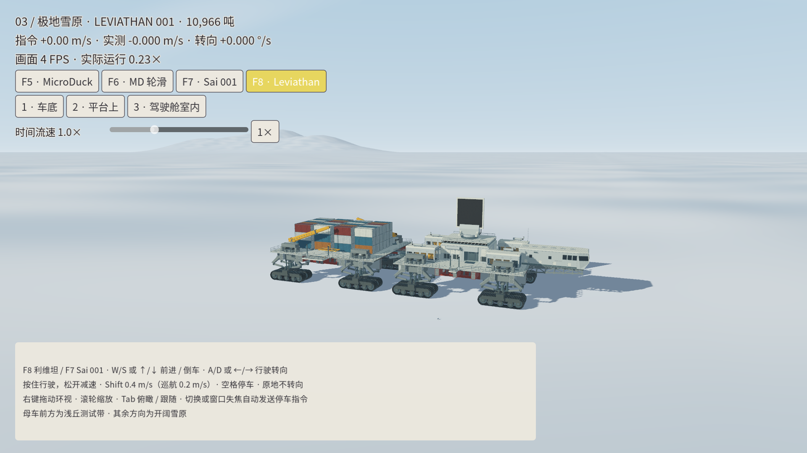

# 03 · 极地雪原：本轮状态（2026-09-15）

用户决定暂时保留此版本，性能工作等待减少刚体数量的新版 Leviathan 后继续。

## 已完成

- 独立约 80 × 80 km 雪原，平整出发区、低矮丘陵、单侧少量远峰；没有环山封边。原科学站地形文件不在本轮变更中。
- 时间倍率默认 1.0×，滑条范围 0.1～3.0×，支持一键回到 1×。撤销原每帧十步带来的约 0.15× 人为上限；每个物理积分步保持 0.5 ms。
- 修复 83 个漏绑部件：货舱、雷达、悬架等不再留在原点附近。104 个渲染根节点与对应物理位置检查通过，最大位置误差为 0。原失败样本最大偏移约 145 m。
- F8 选择母车，W/S 前后驾驶、A/D 行驶转向，空格停车，F7 返回 Sai。60 秒仿真回归通过，包含松键停车、切换后输入清除以及三档时间倍率。
- 保持冻结模型的 154 个刚体、10,966,208.782 kg 质量、2000 步/仿真秒以及 32/4 求解迭代；回归中未检出 JEL 或货物连接失效。
- 已验证的计算实现单独保存在 `integrations/leviathan/backend/`，哈希记录在 `backend.json`；后续设计仓库改动不会静默替换本版运行代码。冻结检查包保持只读。

原生时钟专项检查、60 秒驾驶回归及图形界面的滑条回调检查均通过，覆盖 0.1、1、3 三档，最终恢复 1×。

## 未达到的性能目标

最新图形场景默认 1× 下实测中位帧率约 **4 FPS**，实际仿真速度约 **0.25×**。默认倍率设置为 1× 不等于已经实现实时运行。性能验收明确未通过，用户同意留待新版载具。

旧版本约 30 FPS 来自已撤销的十步上限，不能作为当前默认 1× 的帧率结论。单独载具的计算基准约 0.33× 实时，线程数量与大核调度试验没有显著改善。减少接触诊断的试验虽更快，但改变了物理状态对照结果，未采用。

## 证据与复现

- `evidence/drive-acceptance.json`：60 秒驾驶回归各项断言。
- `evidence/drive-plan.json`、`evidence/drive-source.json`：输入计划与该次运行哈希。
- `evidence/visual-alignment-before.log`、`evidence/visual-upstream-alignment.log`：模型错位修复前后。
- `evidence/simulation_clock-final.log`：三档倍率的物理步长均无误差。
- `evidence/polar_terrain-final.log`：地面碰撞查询无缺口，与显示高度最大误差约 0.75 mm；测试通道起伏约 4.04 m，最大纵坡约 2.47%。
- `evidence/performance-current.json`：当前性能检查失败，保留原始结论。
- 控制器专项测试 9 项通过。附加机器人与出生点入口由并行的入口任务维护，不包含在本报告母车驾驶验收中。

运行 `./run-leviathan.sh` 可直接打开 3 号地图；统一游戏入口亦可选择 03。验证时使用独立的 `--runtime-dir results/leviathan/<名称>` 和 `--output`，避免与正在运行的窗口共用生成目录。

```sh
./run-leviathan.sh --headless --runtime-dir results/leviathan/drive-check --output results/leviathan/drive-check-output --plan docs/polar-range/evidence/drive-plan.json
python scripts/check_leviathan_drive.py results/leviathan/drive-check-output/hub.json
```


