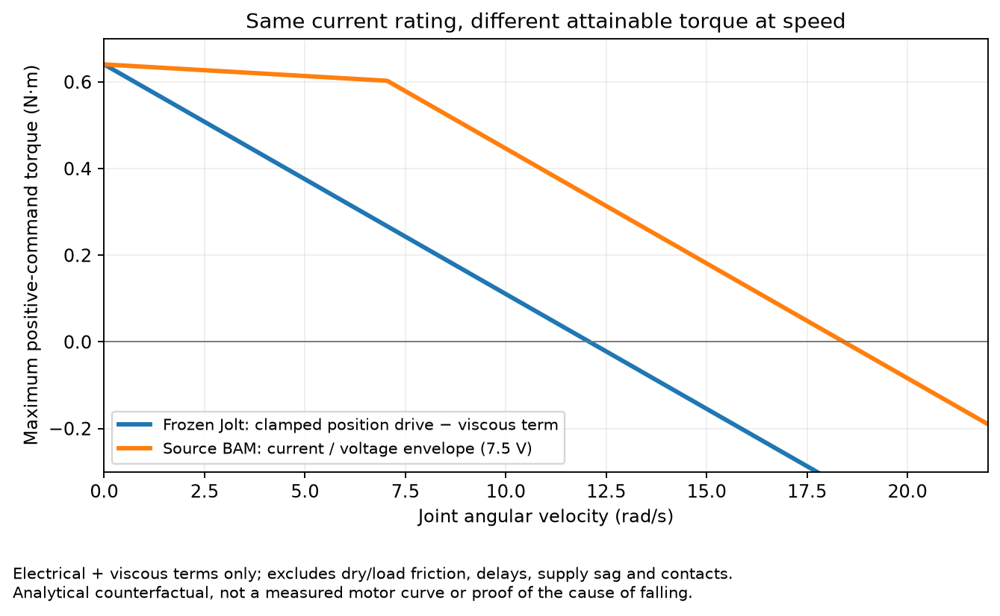

# MicroDuck 快速双足步行与竞速资料核查

检索日期：2026-09-12。任务：为游戏的左 Shift + W 加速寻找可复现的社区经验；保持 Jolt、200 Hz 物理、50 Hz 决策及本项目冻结的物理参数。此次只做联网研究与源码核对，没有运行训练、Godot、模型推理，没有修改代码或部署模型。

**结论：确实有人把同款 MicroDuck 在 MuJoCo 中训到了约 1.5–1.7 m/s 的平均机体前向速度，公开视频的约 2.1 m/s 多为瞬时峰值。最有价值的公开成果有模型、完整训练状态和源码，值得直接做冻结 Jolt 物理的零样本移植。但没有找到同时证明高速、严格直线、任意转弯退出、可靠停步的完整方案，也没有核实到该量级的实机双足速度。**

## 1. 找到了什么，能证明什么

| 项目 / 一手来源 | 核实到的结果 | 证据强度与边界 |
|---|---|---|
| [HannesVonEssen/microduck-running](https://huggingface.co/HannesVonEssen/microduck-running) | 发布 12195 迭代策略；仿真 body-forward 均速 1.651 m/s；512 环境中 508 个未触发作者的跌倒判据 | **强：公开 ONNX、checkpoint、固定源码与评测。** 尚未本地复现；未实机验证；横向和航向漂移明显。 |
| [DuckEMW 作者训练记录](https://github.com/emwstudio/DuckEMW/blob/aa04857ecb6619fc58efc004b611ea9bfeb99729/docs/03-training-log.md) | 13250 checkpoint 的均速约 1.659 m/s；512 环境最大直立瞬时峰值 2.196 m/s，视频 HUD 约 2.06–2.07 | **中：配方与逐轮失败记录公开。** README 说明大型 artifacts 未入库；此次没有找到可直接固定下载的完整对应模型/原始 sprint 电池。不能把峰值或“百米”命名写成完成实测 100 m 直线。 |
| [zhoumiaosen/microduck-running 作者模型卡](https://huggingface.co/zhoumiaosen/microduck-running/blob/main/README.md) | 3 个 10 s 电池平均 1.499 m/s、96.74% 存活；30 s 电池 1.499 m/s、91.21% 存活；2.0 m/s 目标明确未达成 | **中：公开模型及评测；复现源码不足。** 作者说明重构后的准确源码尚无公开 URL；沿初始航向速度仅约 1.234 m/s，不能代替可操控直线加速。 |
| [Ozmium 作者说明](https://docs.ozmium.org/amusement/overview/) | 自报仿真 sprint 排名 3.82 s；明确没有驱动实机；相关速度研究依赖柔顺地面 | **弱于上述可复现发布。** 此次未取得相应固定赛道、完整规则、权重及独立榜单；不据此计算速度或推荐改变我们的地面。 |

以下结果不计入双足高速证据：

- [Nirav-Madhani 的 Microduck Racer 源 README](https://huggingface.co/spaces/Nirav-Madhani/microduck-racer/blob/main/README.md) 是四只鸭子的 **roller** 竞赛，保留 `BEST_roller.onnx`，学习/控制层是 waypoint；跌倒后在当前位置恢复并保留进度，不符合本项目无跌倒硬门槛。
- [DuckWing V80](https://huggingface.co/juicenv/duckwing-v80-roller-skating) 是被动轮滑。其 race-line 控制和 residual 思路可供阅读，但轮滑速度不能当双足步行上限。
- Max Sumrall 的 1.8/1.9 m/s 线索可从作者相关社交传播和 DuckEMW 记录找到；本次没拿到准确原帖与公开配方的完整证据链，不把转引数字当作已核验成绩。

## 2. 最值得立即验证的外部模型：固定契约

Hugging Face 固定 revision：`dd11bd188edce3ebae8f60ce54c77b0d6098d00a`。以下数据已从作者 manifest 与 Hugging Face 文件元数据交叉核对；本研究没有下载模型二进制，因此 SHA 是**发布者/存储元数据校验值**，加载方仍需自己重算。

| 文件 | 固定下载位置 | 大小 / 校验 |
|---|---|---|
| ONNX | [policy.onnx](https://huggingface.co/HannesVonEssen/microduck-running/resolve/dd11bd188edce3ebae8f60ce54c77b0d6098d00a/policy.onnx) | 793,744 bytes；SHA256 `007707dd7779b2756ded67c58b2e9f94fe5071794a48c2b5a20d5f8d841efbeb` |
| manifest | [manifest.json](https://huggingface.co/HannesVonEssen/microduck-running/resolve/dd11bd188edce3ebae8f60ce54c77b0d6098d00a/manifest.json) | 5,822 bytes |
| config | [config.json](https://huggingface.co/HannesVonEssen/microduck-running/resolve/dd11bd188edce3ebae8f60ce54c77b0d6098d00a/config.json) | 442 bytes |
| 校验表 | [SHA256SUMS](https://huggingface.co/HannesVonEssen/microduck-running/resolve/dd11bd188edce3ebae8f60ce54c77b0d6098d00a/SHA256SUMS) | 2,142 bytes |

作者的 [固定 infer_policy.py](https://github.com/Vottivott/microduck-playground/blob/828d950134e29a8d04cbb51720a22c8729047fb7/scripts/infer_policy.py) 明确以下排列。需开启新的 13 维命令契约；旧脚本说明中的 51D 是兼容分支，不是该模型的输入。

| 区间 | 定义 |
|---|---|
| `0:3` | 机体系 IMU 角速度 |
| `3:6` | 世界单位重力 `[0,0,-1]` 旋转到机体系 |
| `6:20` | 14 个关节位置减 HOME |
| `20:34` | 对应 14 个关节速度 |
| `34:48` | 前一个决策的原始 action；复位为零 |
| `48:51` | `[vx, vy, wz]`，m/s、m/s、rad/s |
| `51:55` | head command；该跑步策略用零 |
| `55:61` | body command；该跑步策略用零 |

输入 `obs` float32 `[1,61]`，输出 `actions` float32 `[1,14]`，50 Hz。输出为相对 HOME 的关节位置偏移，scale 1.0，**没有输出裁剪、没有二次观测归一化**。它不是循环策略：512/256/128 ELU MLP；机体线速度仅供 critic，actor 不需要额外线速度或隐藏历史。训练观测中存在传感器延迟，与要求部署端堆叠历史不是一回事。[网络与观测配置](https://github.com/Vottivott/microduck-playground/blob/828d950134e29a8d04cbb51720a22c8729047fb7/src/mjlab_microduck/tasks/microduck_velocity_env_cfg.py)

HOME（rad）：

```text
[0, -0.0873, -0.4579, -0.0049, 0.4530,
 0.3491, 0.3491, 0, 0,
 0, 0.0873, 0.4579, 0.0049, -0.4530]
```

顺序：左髋 yaw/roll/pitch、左膝、左踝、neck pitch、head pitch/yaw/roll、右髋 yaw/roll/pitch、右膝、右踝。`target=HOME+action`。训练 HOME 与作者推理脚本一致。[训练常量](https://github.com/Vottivott/microduck-playground/blob/828d950134e29a8d04cbb51720a22c8729047fb7/src/mjlab_microduck/robot/microduck_constants.py#L225)

## 3. 高速数字的评测边界

[作者原始发布结果](https://github.com/Vottivott/microduck-playground/blob/828d950134e29a8d04cbb51720a22c8729047fb7/experiments/running/eval/released_12195.json) 区分：nominal 机体前向 1.65109 m/s，初始航向位移速度 1.24380 m/s，平均绝对 heading 31.3265°。受扰条件下前向机体速度约 1.635 m/s，但初始方向进度约 1.011 m/s。**因此“身体跑得快”与“沿用户想要的方向快”在这里差距很大。**

[实际 evaluator](https://github.com/Vottivott/microduck-playground/blob/828d950134e29a8d04cbb51720a22c8729047fb7/scripts/evaluate_running_checkpoint.py) 还有三个必须保留的细节：

1. `terminations.clear()`，超过 **70° tilt** 才手工记跌倒，首次触发后永久记失败；它没有用本项目更严格的稳定高度、倾斜、方向、停步门槛。
2. `duration_s=10` 是总仿真时长；warmup 1 s 在循环内剔除，实际速度累计窗口约 9 s。文档“1 s warm-up + 10 s measurement”的措辞与代码不完全一致，以代码为准。
3. speed 统计 warmup 后尚未跌倒的样本，后来跌倒的轨迹也贡献跌倒前速度；另有 clean-survivor 字段。不能把 99.22% survival 写成严格验收零摔，也不能从 10 s 推断长时间稳定。

正常 preview 有独立 10 s/50 fps 文件及校验记录，作者没有把其标为实机。另一个“撞垫火花”影片明确使用旧 8749 策略，包含脚本化障碍、碰撞增强与冲击后电机截止；不能用该编辑演示判断已学会停步/避障。[固定模型卡](https://huggingface.co/HannesVonEssen/microduck-running/blob/dd11bd188edce3ebae8f60ce54c77b0d6098d00a/README.md)

## 4. 它没有改什么，又放宽了什么

已比较固定 fork `828d950` 与它声明的 upstream `d424a0c`：机器人 XML 与配置（包括 `robot_walk.xml`、`robot_allcollisions.xml`、`joints_properties.xml`、`scene.xml`、对应配置）的 Git blob 相同；walking 基础任务 Python 文件逐字节相同。两棵树可直接复核：[fork 树](https://api.github.com/repos/Vottivott/microduck-playground/git/trees/828d950134e29a8d04cbb51720a22c8729047fb7?recursive=1)、[upstream 树](https://api.github.com/repos/pollen-robotics/microduck_rl/git/trees/d424a0c899f6b33cbd3daeb279913134349c0b63?recursive=1)。这支持“沿用原始机器人资产”，**不等于与当前 Jolt 接触/执行器实现数值相同**。

固定 BAM 配置仍为 XL330 M6、`kp_fw=200`、电压 6.5–8.2 V、电压下限 6 V、3–6 physics-step 延迟。fork 的摩擦执行器差异是可选诊断，最终仍调用上游 `super().compute`。[执行器实现](https://github.com/Vottivott/microduck-playground/blob/828d950134e29a8d04cbb51720a22c8729047fb7/src/mjlab_microduck/actuator/friction_dr_bam.py)

**电流限制已继续追到依赖，不能只看任务配置中的注释：** [uv.lock](https://github.com/Vottivott/microduck-playground/blob/828d950134e29a8d04cbb51720a22c8729047fb7/uv.lock#L103) 固定 `better-actuator-models 1.0.1`，实际 Git revision 为 `Rhoban/bam@62bd8ce12154340be97e06f7f41a0ca8f116d967`；`xl330` 创建 `XL330Actuator`，其构造函数明确设置 `max_current=1.75`，不是无限流默认。[映射](https://github.com/Rhoban/bam/blob/62bd8ce12154340be97e06f7f41a0ca8f116d967/bam/actuators.py#L20)、[XL330 构造函数](https://github.com/Rhoban/bam/blob/62bd8ce12154340be97e06f7f41a0ca8f116d967/bam/dynamixel/actuator.py#L89)

但它的含义是先根据电流目标与反电动势求可用 PWM 窗口，再夹到电池允许的 `[-1,1]`；**不是对最终电机扭矩硬夹 `±kt×1.75`**。高反电动势时 PWM 可能无法维持电流限制，代码明确指出可能超限；因此即使两个实现都写着“1.75 A”，仍需逐状态对照控制公式。[限流与反电动势实现](https://github.com/Rhoban/bam/blob/62bd8ce12154340be97e06f7f41a0ca8f116d967/bam/actuator.py#L220)、[mjlab 包装调用](https://github.com/Rhoban/bam/blob/62bd8ce12154340be97e06f7f41a0ca8f116d967/bam/mjlab.py#L612)。该源码证据排除了“作者默认完全不限电流”的假设，尚未证明本次 Jolt 失败由哪一项导致。

### 与本项目实际执行器的只读对照

当前源码 [physics_server.gd](/home/ethan/Projects/MicroDuck/sim2sim/godot/physics_server.gd:1446) 和本次冻结的 [robot_spec.json](/home/ethan/Projects/MicroDuck/sim2sim/results/sprint_exit_20260912/running_zero_shot/suite/runtime/generated/microduck/robot_spec.json) 表明，本项目使用 **XML 线性 PD 近似，不是完整 BAM**。14 个执行器均为 `kp=.55, kv=0`；关节 `damping=.053, frictionloss=.0048, armature=.0018`。原 XML force range 为 ±.96 N·m，但独立入口会覆盖为 `kt×1.75 = .6405236196 N·m`。[运行时覆盖](/home/ethan/Projects/MicroDuck/sim2sim/godot/standalone/driver.gd:127)

| 项目 | 固定 running 训练源 | 本项目实际 Jolt | 已证实差异 / 待定 |
|---|---|---|---|
| 物理与决策频率 | mjlab 1.3.0 基础 velocity 配置 `dt=.005`、decimation 4 | 200 Hz、4 倍抽样、50 Hz | **频率一致**；spec 的 `dt_xml=.002` 不是实际运行 tick。[源基础配置](https://github.com/mujocolab/mjlab/blob/v1.3.0/src/mjlab/tasks/velocity/velocity_env_cfg.py#L442) |
| 电机饱和 | 电压→PWM 电流窗口→电池 PWM 饱和→反电动势电机扭矩 | `clamp(.55×error, ±.6405236) - .053×qdot` | **夹限顺序与高速反电动势关系不同**。Jolt 的阻尼在夹限后，因此不是最终净关节扭矩始终不超过 .6405。 |
| 供电 | 6.5–8.2 V 与随负载变化的 voltage sag | 无动态供电变量，固定 kp/damping | **不同**。源随机化覆盖不同电压，不能因此假定包含线性饱和 PD。 |
| 摩擦 | M6 的 Coulomb/Stribeck/负载相关摩擦预算写入 MuJoCo 约束，静摩擦由求解器处理 | `.0048×tanh(qdot/.05)` 直接减去，再有粘性阻尼 | **不同**：零速静摩擦、负载依赖和换向附近都不等价。 |
| 动作延迟 | 3–6 个 .005 s 物理步，约 15–30 ms | 新 `_ctrl` 直接进入下一物理步 PD；没找到独立执行器延迟队列 | **不同**。决策 sample-and-hold 不是额外电机响应延迟。 |
| 转子惯量 | 关节空间 armature，M6 nominal .0018077433 | `.0018` 投影到子刚体对角惯量，其他主轴抬到最大值的 1/10 | **数值接近但映射不同**；[本地映射](/home/ethan/Projects/MicroDuck/sim2sim/godot/physics_server.gd:358)。 |
| 接触 | MuJoCo/Warp 接触求解；BAM 对关节静摩擦约束有专门处理 | Jolt 刚体接触；SOLE/JAW/FLOOR springs 都关闭 | **求解器不同**；尚未用同状态接触冲量对照确定失稳主因。 |

不是所有参数都相差很大：用源 M6 的 `kt=.3660134969`、`R=2.8113923539`、XL330 error gain、7.5 V 和 firmware kp 200 推导，小信号位置刚度约 **.561906**，电气加粘性阻尼约 **.0530107**，接近当前 `.55/.053`。这支持“低速线性近似有依据，高速/换向/饱和区可能失配”的假设，而非仅仅 kp 少乘几十倍。[M6 参数](https://github.com/Rhoban/bam/blob/62bd8ce12154340be97e06f7f41a0ca8f116d967/bam/params/xl330/m6.json)

据此登记的下一步是**离线**把失败轨迹的相同 `q/qdot/target` 送进两个执行器公式，比较进入饱和前后的扭矩差，无需修改游戏。后续已完成第一轮，结果见第 8 节。若差异集中且显著，训练侧应使用与冻结游戏一致的电机模型做 GPU 教师适配；不要把游戏改成源 BAM 来掩盖迁移问题。

主要变化在目标与课程：[running 任务源码](https://github.com/Vottivott/microduck-playground/blob/828d950134e29a8d04cbb51720a22c8729047fb7/src/mjlab_microduck/tasks/microduck_running_env_cfg.py)。线性前进奖励与速度命令上下界一起抬升，3% 独立零命令桶；弱化初期动作率、姿态、滑移税，停止精确 head/body pose 跟踪。yaw 仅 ±0.05 rad/s、横移仅 ±0.02 m/s。12 s 回合中命令基本不变，**持续转向、转向退出与高速停步并未得到充分课程覆盖**。

开发记录显示先探索速度、后增加扰动；目标从 1.65 往上每阶段约 750 次更新缓升，2.2 m/s 命令后实际速度约 1.68 平台；提高命令到 2.3–2.5 不能继续增速，过快课程与更强速度奖励反而更差。[速度与鲁棒化记录](https://github.com/Vottivott/microduck-playground/blob/828d950134e29a8d04cbb51720a22c8729047fb7/docs/running_policy_summary.md)

DuckEMW 独立日志也记录了站桩刷奖励、原地跳刷 airtime、强速度权重续训回退。其官方 walking 的 CPU BAM probe `cmd=0.4` 实际约 0.164 m/s，与本项目旧版约 0.167 m/s 接近；互联网“原版 0.4 m/s”的表述常混合命令值与实测值。这是第三方作者的复测记录，未在本任务重新运行。[训练日志 Phase 0–收官](https://github.com/emwstudio/DuckEMW/blob/aa04857ecb6619fc58efc004b611ea9bfeb99729/docs/03-training-log.md#徒脚极速-sprint2026-09-03phase-0-1)

## 5. 三个最有价值的可检验方向

这些是由证据推导的下一步实验建议，不是已达成结果。顺序应是先辨别可移植速度能力，再花 GPU 预算适配，最后形成可操控的统一策略。研究期间主任务已完成下面 A 的第一轮边界检查，见文末结果。

### A. 先做外部跑步策略的零样本移植，测出真实速度上限与差距位置

固定上述小型 ONNX，核对契约与原生/Python action parity；保持全部 Jolt 物理及执行器。独立 candidate 模型槽，从站姿完整起步，做有限的命令阶梯和停步（包括作者 2.2 命令），记录**沿初始目标方向进度**、机体前向速度、倾斜/高度、首次跌倒、关节目标饱和与执行器输出。相同初态与旧 walking/S05 对照。高速 actor 只有微小 yaw 训练范围，A/D 失败可作为能力边界，不能隐藏。

这个实验回答“我们是没有高速步态，还是高速步态在 Jolt 上失配”。若未经训练就明显快起来，应转向迁移与操控适配；若迅速失稳，应定位接触、延迟、动作目标差异，不要为了复现 MuJoCo 数字修改冻结物理。

### B. 把高速步态发现与普通步行保持分开训练，再用完整控制任务合并

现有 S05 附近的小残差与教师约束可能限制跨越步态局部最优；外部结果证明至少在源仿真中普通 61D MLP 就能产生高速步态，**没有证据要求先引入 LSTM 或扩大模型**。优先比较两个可追溯起点：已有高速 donor 和 S05；CUDA 端用匹配课程适配到本项目契约。高速段允许形成新步态，普通/idle 段才施加保持约束，避免全分布强 KL 把速度增益拉回旧步态。把速度奖励从过窄目标点跟踪改为带安全门控的前进收益，是需要做消融的目标结构变化。

可直接迁移的是课程节奏、奖励门控、源 checkpoint 和阶段评测纪律。新增 CoM/摩擦/电机随机化等会改变冻结实验边界，本轮不照抄；更不能通过关掉碰撞、改电流、软化地板取速度。

### C. 把转向退出和制动作为高速任务本体，优化实际行进方向

所有已核验的高速案例都暴露 heading 或持续可靠性缺口。训练必须覆盖完整的 idle→加速→持续左/右转→加速直行→松 Shift→停步，不只随机速度常量。速度目标使用目标路径切向进度，横向误差、yaw 误差与速度关联评价；从转向末段/制动前状态开始的恢复课程可提升稀少过渡段的数据占比。使用现有原生输入回放、保持采样顺序，并把停止过程纳入每次候选验收。

若评测“body-forward 很高但目标方向速度低”，不要接受；若严格直线和停步可靠但加速不足，再扩速度课程。仍沿用本项目零跌倒、方向与正常步行不回退的门槛，不把作者 70°/10 s survival 借来降低标准。

## 6. 研究期间新增的 Jolt 零样本证据

主任务在原生 ORT、冻结 Jolt/200 Hz/50 Hz 下使用上述准确 SHA 的原始 ONNX 与 HOME，普通段保留 S05；1 s 按 Shift 后交给 running actor，只给前向命令，没有路径/航向反馈。命令 0.3 和 2.2，各使用开发种子 `923000–923003`，共 8 条。已读取 [completed.json](/home/ethan/Projects/MicroDuck/sim2sim/results/sprint_exit_20260912/running_zero_shot/completed.json)：运行错误为 0，actor 选择均通过，但 **8/8 跌倒，首次跌倒在回放 1.78–1.98 s，即切入跑步约 0.78–0.98 s 后**。

这证明当前直接替换的迁移方式不可用，不能据此反驳作者在 MuJoCo 下的速度，也不能据此认定 Jolt 永远达不到高速。此时 A 的后续动作应变为：核对实际动力学、BAM 电流限制/延迟及切换状态分布，区分源训练模拟器中本来就依赖的条件与可学习适配的差距；不要反复抬命令或偷偷修改冻结物理。该结果也意味着 B 应先建立带执行器约束的高速教师与迁移课程，而不是直接把 donor 包装成游戏成品。

主任务随后又验证了 [fast_entry_check/completed.json](/home/ethan/Projects/MicroDuck/sim2sim/results/sprint_exit_20260912/fast_entry_check/completed.json)，本研究已读取：350 行原生/Python 影子最大观测误差 `4.796e-14`，action/ctrl/last-action 最大 `5.329e-15`，技能选择无差异。冷启动 4 条全部失败（首次跌倒 1.02–4.14 s）；由源 actor 先执行零命令的 4 条也全部失败（0.92–1.22 s）。因此**原生输入/推理数值错误和一次性 S05→running 切换都不足以解释全部失败**，应优先进入上述动力学差距诊断。

## 7. 本次研究的边界

已覆盖中英文网络、原作者 GitHub/Hugging Face、官方原仓库、国内 DuckEMW、竞速与轮滑项目；公开社交镜像只用于寻找原始线索，没有作为核心技术依据。未登录社交平台、未联系作者、未提交/上传任何外部内容。未核实到高速实机测量，不等于不存在；若用户之后提供看到的视频链接，可进一步查它是否双足、是否原速、是否沿直线以及底层物理与停步条件。

## 8. 后续离线同状态电机对照

主任务已将固定版本 BAM 的电压/限流公式在同一批 `q、qdot、target` 上与冻结 Jolt 电机公式对照：[完整结果](../results/sprint_exit_20260912/torque_comparison/completed.json)、[可复算脚本](../results/sprint_exit_20260912/torque_comparison.py)。下载源码仅阅读，未导入执行；来源与校验记录在 `bam_source/sources.json`。

仅计首次跌倒前的加速样本，在名义 7.5 V、kp 200、kd_scale 1 下比较**电气加粘性项**：

| 输入轨迹 | 两公式扭矩差 RMS | 绝对差 P95 | 差异 >0.1 N·m 的关节样本比例 | BAM 触发电流限幅比例 |
|---|---:|---:|---:|---:|
| 外部 running，8 条 | 0.1190 N·m | 0.3358 N·m | 22.62% | 45.92% |
| S05，本地右转 14 秒 | 0.00350 N·m | 0.00722 N·m | 0% | 0% |

在小误差/低关节速度样本中，running 的平均绝对差约 0.0030 N·m，符合前述小信号近似接近的判断。这是**高速策略已经进入不同执行器工作区间**的证据：Jolt 会先夹位置项再减速度阻尼，BAM 则根据速度移动可用 PWM 窗口。它解释了为何低速来源较容易兼容、高速来源不能直接互换，但尚不能独立证明跌倒的主要原因。

此计算是 50 Hz 状态快照上的同输入反事实比较，**不是完整 BAM 重放，也不是实测净关节扭矩**；未推断缺失的负载/静摩擦约束、供电历史、15–30 ms 延迟、接触冲量或转子惯量映射。还保存 6.5/8.2 V 的敏感性对照。游戏物理完全未改。后续若推进高速 donor，应优先在训练域适配这些冻结执行器规律，并在 Jolt 完整转向/停步中验证，而非直接增大游戏命令。

进一步按同样边界求当前 Jolt 可达扭矩范围，名义 7.5 V 下 running 的 **31.52%** 关节样本所需电气/粘性扭矩超出该范围（6.5/8.2 V 为 28.21%/33.71%）；S05 在三种电压对照均为零。这意味着保持同样 `q/qdot` 时，仅反算更大的 action 不能全部补偿，必须改变步态或状态分布。[可达性记录](../results/sprint_exit_20260912/torque_comparison/envelope.json)仍不包含干摩擦或动力学因果验证。



## 9. GPU 短时物理诊断与下一轮优先级

主任务进一步在 NVIDIA GB10 上实际运行 MuJoCo/Warp：从首次跌倒前的 90 个 Jolt 状态投影出发，保持相同关节目标，推进 4×5 ms。在匹配电机公式之外补齐当前 Jolt 的转子对角惯量映射，20 ms 后关节速度 RMS 误差由 0.8234 降到 0.3430 rad/s，身体 COM 速度分量 RMS 由 0.0370 降到 0.0226 m/s。游戏物理未改，没有进行学习。[原始结果](../results/sprint_exit_20260912/gpu_dynamics_probe/gpu_completed.json)

这说明惯量表示差异值得处理，不能据此宣称 GPU 代理已对齐。独立刚体约束偏差使完整脚部状态无法精确投影到关节坐标：同批 90 个快照左右脚初始位置差 P95 约 2.22/2.14 mm，速度差 P95 0.112/0.093 m/s。同 MuJoCo 模型的 CPU/Warp 接触响应也非逐位相同，短时 qvel 差最大达到 0.432 rad/s；需要区分初态投影、接触求解与代理动力学。[完整诊断及局限](sprint_exit_20260912/RESULT.md)

另一项可直接从代码确认的缺口是本地 GPU 训练代理将 `lin_vel_y` 固定为零，而游戏路径反馈请求横移纠偏。下一轮应先审计训练任务构造后的资产/碰撞/惯量，拆分接触误差，并覆盖真实转向退出、横移纠偏和停步课程；再比较 S05 与高速 donor 的 GPU 适配。这里主张改变训练域，保持游戏 Jolt 与执行器冻结，尚未证明能达到作者在 MuJoCo 下的高速结果。
