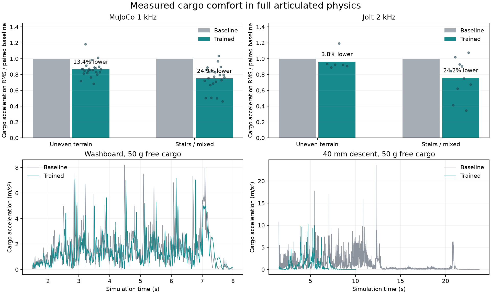

# Sai 载货悬挂：MuJoCo 训练与双引擎验收

2026-09-15。本次结果取代第一阶段空载结论。默认入口采用 `suspension-v2.json`，神经网络权重不变，训练并部署的是其下方的有界主动悬挂控制。

## 最终行为

- 连续凹凸地面：识别真实边缘，避免将坡面和波浪地形误判成台阶。支撑腿跟随地面、补偿承重，保留有限刚度和阻尼；不会靠反复高抬腿来“悬挂”。
- 上台阶：保留原抬腿动作及摆动腿控制力度，支撑腿采用训练出的柔顺控制。
- 下台阶：明确的下降边缘在已验证范围内用轮腿顺势伸展，避免向上抬脚减少支撑而引发前倾。下降请求限至 0.16 m/s；高度超过 45 mm、含向上边缘或无法可靠判别时沿用原阶梯逻辑。
- 转向：120 ms 平滑增强支撑，最多混入原控制的 25%，解决转弯速度回退。低速、倒车与蹲姿均有带载回归检查。

## 训练是真实物理，不是动画调参

训练使用完整 MuJoCo 机器人、真实轮地接触、关节限位和电机上限；物理 1 kHz，策略 50 Hz。货物为独立自由刚体，分别 50 / 100 / 250 g；额外测试现有货夹真实闭合的 100 g 运输。未焊接货物，未降低摩擦、质量或地形难度，运行中不修改机器人或货物位姿。

先用低刚度与承重补偿的因果探针排除会下沉或失稳的方案，再用六参数 CEM 训练 60 个候选，每个覆盖 12 工况，共 **720 个训练候选回合**。参数包括支撑刚度、阻尼、承重补偿、车身高度弹簧/阻尼及参考平滑时间。随后扩展开发工况筛选、诊断下降动作，再对转向支撑做单变量训练。训练不是重新训练 PPO/ONNX；这种有界控制分解保留原有行走技能，减少策略整体漂移。

失败候选和两轮失败保留集都已明确转为开发数据；最终 MuJoCo 随机场景采用新的 3001 / 3203 / 3407 / 3607 种子，冻结后一次验收。详见 [完整迭代记录](CARGO-ITERATIONS.md)、[实施前协议](CARGO-PLAN.md) 和 [原始训练人口](cargo-training-trials.jsonl)。

## 最终验收结果

全部通过：**MuJoCo 110 个对照回合、Jolt 40 个对照回合，共 150 回合**。其中每种方案各 75 回合；“全部通过”指候选满足验收条件，并非旧对照也全都成功。

- MuJoCo：45 个地形/载荷/初始状态工况 × 两种控制，另 10 个驾驶工况 × 两种控制。
- Jolt：16 个地形/载货工况 × 两种控制，另 4 个转向工况 × 两种控制。
- 地形包含二维随机起伏、搓板、凹坑、凸包、横坡、纵坡、20 / 40 mm 上下阶及起伏接阶梯。MuJoCo 改变入场角、起点、踏面长度、起伏幅度和载荷。
- 候选无跌倒、无掉货；双侧夹持、车身高度和速度门槛均通过。独立 MuJoCo 连续地形最小平均速度 0.422 m/s，台阶/混合最小 0.084 m/s。
- 17 个相关单元/合同测试通过；256 个电机力矩对照样本的 Python/Godot 最大误差为 8.88e-15。MuJoCo 1 kHz / Jolt 2 kHz 每个物理子步都按当前关节位置与速度执行同一力矩公式，腿力矩上限仍为 8 Nm。

下表为各工况“候选 / 同条件旧对照”比值的等权平均。旧对照已经包含第一阶段的地形分类与几何悬挂，仍使用原固定 PD。因此这些是进一步改善载货舒适性的收益。

| 引擎与地形组 | 货物持续颠簸 RMS | 较大颠簸 P95 | 货物加速度变化率 RMS | 货台点加速度 RMS |
|---|---:|---:|---:|---:|
| MuJoCo 连续凹凸/坡面 | −13.4% | −14.3% | −23.1% | −22.0% |
| MuJoCo 台阶/混合 | −24.9% | −22.4% | −38.1% | −36.6% |
| Jolt 连续凹凸/坡面 | −3.8% | −5.0% | −13.1% | −11.9% |
| Jolt 台阶/混合 | −24.2% | −24.7% | −36.6% | −34.2% |



持续颠簸为世界坐标中货物三轴加速度合成值，15 ms 一阶低通后计算；另存未经滤波的每子步峰值。货台点包含背部位置的转动杠杆效应。稳态测量从 1.5 s 起，到停止请求/台阶完成前；下方时间曲线额外显示停止段，不用于偷偷延长平均时间。

**局限保留：**均值改善不意味着每一个地形或冲击都改善。MuJoCo 的 45 个地形工况中有 7 个原始瞬时峰值增加；Jolt 的 16 个工况中有 5 个增加。两个引擎的接触算法以及货夹传动（MuJoCo 理想等式、Jolt 弹性传动）不同，不直接比较跨引擎单个峰值。这里验证的是 20 / 40 mm 台阶及给定凹凸幅度，未声称覆盖任意台阶、悬崖、任意载重或真实硬件。

## 可检查的物理回放

- [MuJoCo 搓板路同场对照：左旧控制，右训练后](mujoco-washboard-comparison.mp4)
- [MuJoCo 凹凸地面接 40 mm 台阶](mujoco-mixed40.mp4)

视频只渲染已记录的 MuJoCo 全关节/货物物理状态，不重新驱动，也不插入稳定动画。

真实科学站入口额外检查 449 帧控制交换，全部携带新力矩合同；2–6 s 内约 **0.500 m/s、平均四轮接触 4.0、台阶模式 0 帧**，无脚本错误。游戏场景仅是接入检查，不替代上述 MuJoCo 训练与验收。

## 证据与复现

[MuJoCo 地形验收](accept-mujoco.json) · [MuJoCo 驾驶验收](accept-driving-v2.json) · [Jolt 地形验收](accept-jolt.json) · [Jolt 转向验收](accept-native-turns.json) · [测试日志](units-final.log)

原始物理子步、全状态回放、失败候选、训练源代码快照及运行时保存在主项目 `results/sai-cargo-suspension-20260915/`。第一阶段独立保留在 `results/sai-suspension-20260915/`，其 [历史结论](PHASE1-RESULT.md) 不代表最终载货验收。

在安装 Sai 可选依赖的项目 Python 下，使用 `PYTHONPATH=src` 运行：

```bash
python scripts/train_sai_loaded_suspension.py --out results/new-training
python scripts/validate_sai_loaded_suspension.py --final --round 2 --profile src/sim2sim/assets/sai/suspension-v2.json --out results/new-loaded-mujoco
python scripts/validate_sai_loaded_native.py --profile src/sim2sim/assets/sai/suspension-v2.json --out results/new-loaded-jolt
python -m unittest tests.test_sai_impedance tests.test_sai_suspension tests.test_sai_terrain
```

原训练循环的确切历史实现应使用训练目录的源代码快照；当前源码包含后续下降/转向修正，重新运行属于新实验。最终验收源代码、配置和数据均已归档。`SIM2SIM_SAI_SUSPENSION_PROFILE=off` 可显式回到固定 PD；默认科学站/工坊 Sai 入口加载通过验收的 v2。

研究依据见 [轮腿与悬挂研究](RESEARCH.md)、[载货与阻抗研究](CARGO-RESEARCH.md)，包括 [ANYmal 轮腿运动研究](https://arxiv.org/abs/2405.01792)、[轮腿粗糙地形学习](https://arxiv.org/abs/2402.06143) 和 [Ascento 全身控制](https://arxiv.org/abs/2005.11431)。论文提供结构依据；本文数值全部来自本项目实际物理测量。
