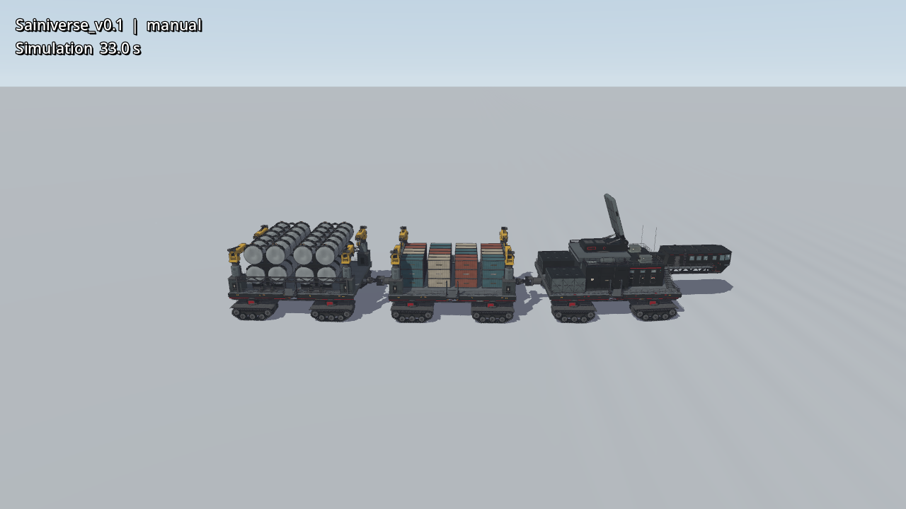
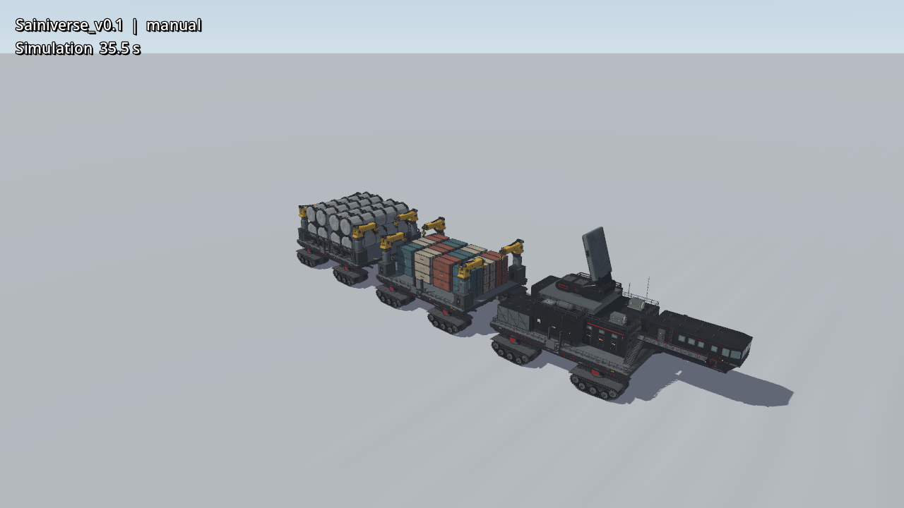
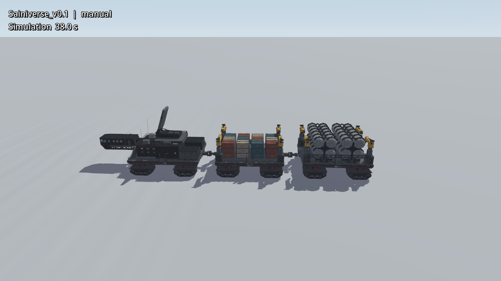
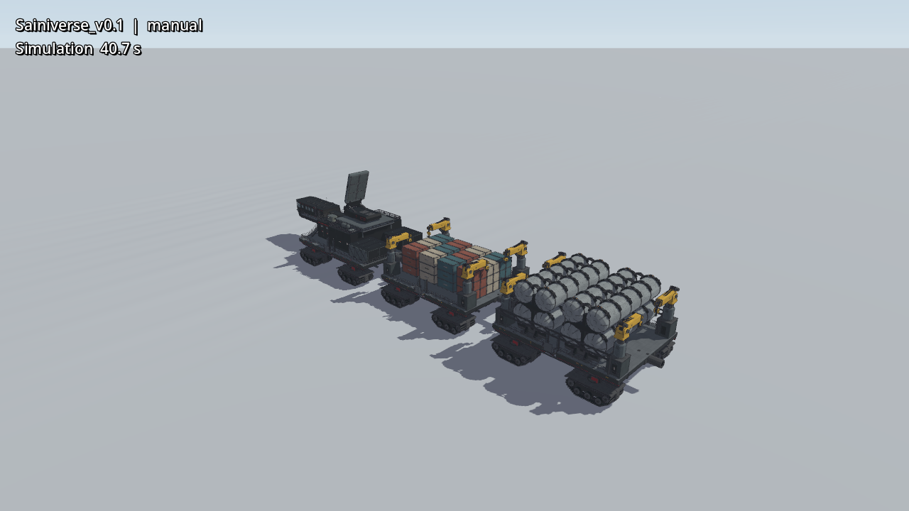

# Sainiverse v0.1 · 极地雪原全车 PV

这段 [10 秒 GIF](media/sainiverse-polar-panorama.gif) 和 [1280×720 MP4](media/sainiverse-polar-panorama.mp4) 从同一 Godot/Jolt 极地场景录制。母车接受 W/A 游戏输入回放并移动，镜头跟随车体转向。150 张原始画面以 15 FPS 播放；没有插帧或合成车体动作。GIF 缩为 960×540，MP4 保留 1280×720。

四个机位各约 2.5 秒，每个镜头都保留整车：

| 机位 | 实机截图 |
| --- | --- |
| 第一侧全景 |  |
| 前侧三分之四 |  |
| 另一侧全景 |  |
| 后侧三分之四 |  |

录制前后逐镜头检查了整车边界：车头、尾车、履带和上层设备均未被画框裁断；镜头没有穿入车身。原生运行在 44 秒处以 `failed:false` 结束，前车纵向移动约 34.9 m，峰值约 18.0 km/h。录制使用固定的机位切换与实际游戏输入回放：

```bash
SAINIVERSE_DRIVE_PROBE=1 ./run-sainiverse-v0.1.sh \
  --mode manual --terrain polar --view polar_panorama --seconds 44 \
  --pv --pv-fps 60 --clean-capture --output /tmp/sainiverse-polar-wide-pv
```

Sai 登船、机械臂操作和 MicroDuck 巡视的 GIF 也在[游戏首页](../README.md#03--极地雪原--sainiverse-v01)。机器人完整路线与帧率见 [Sai_Art 验证记录](https://github.com/sgyli7/Sai_Art/blob/main/docs/VALIDATION.md#polar-game-integration-2026-09-20)。
