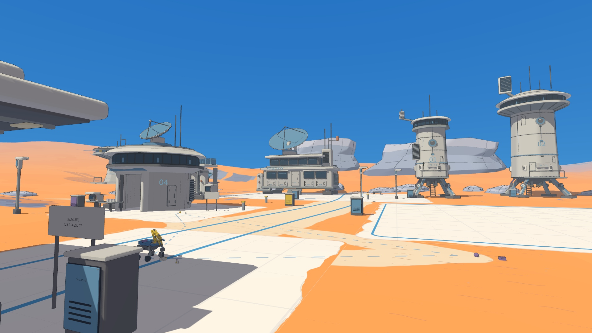
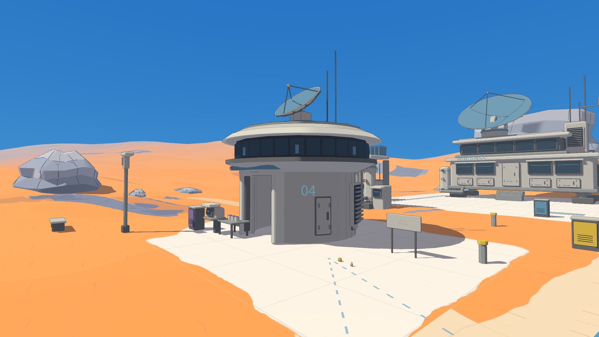
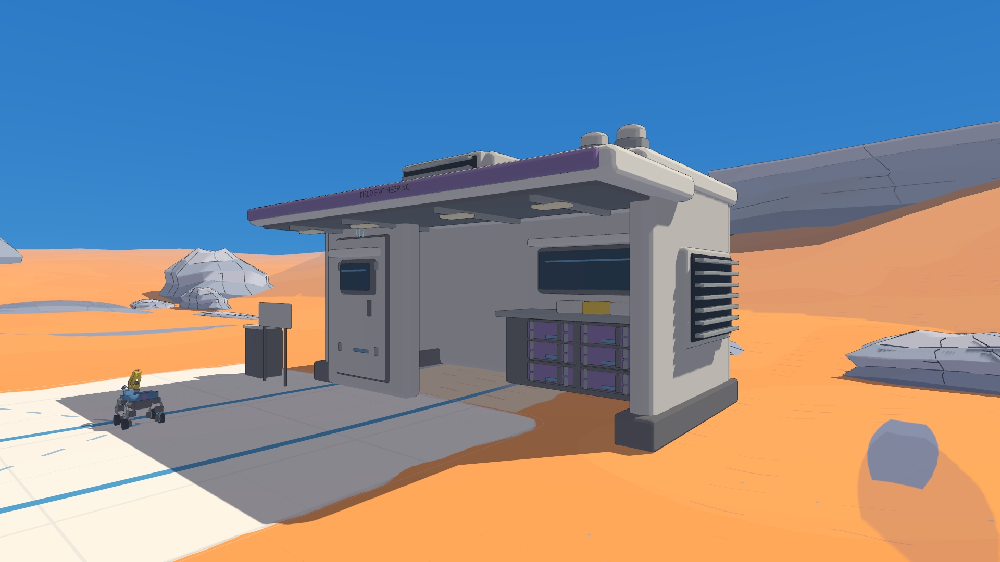
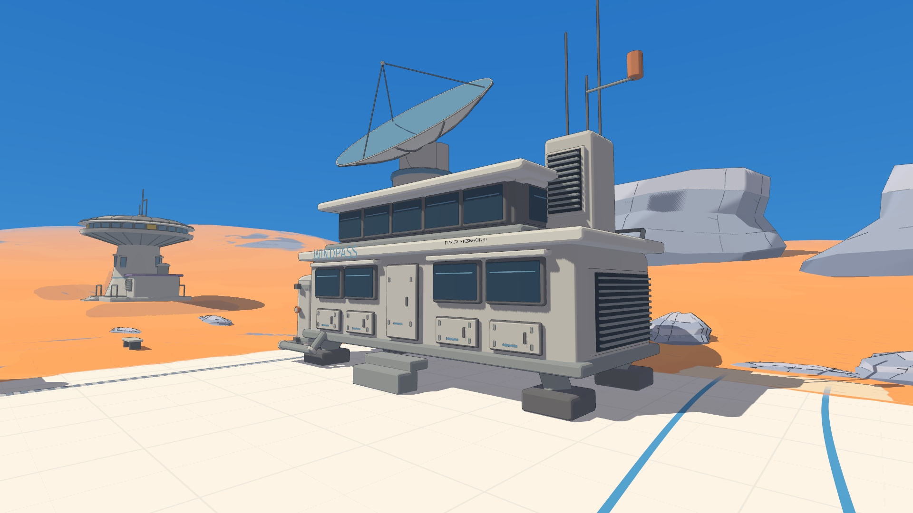

# 风口科学站：复古科考设施重建

本页记录建筑重建阶段；当前地表与气象台场地见[2026-09-14 版本](terrain-20260914/RESULT.md)，图像链接随最新场景更新。

这一版重新设计建筑本体，让正常游玩距离下的轮廓、材料和设备用途共同表达异星科学站。

服务小院改为预制维修舱：厚壁舱门、带隔热层的悬挑顶、凹入工作灯、密封工具抽屉与屋顶排气组。紫色只用于檐口和工具件。原来的细柱平顶棚已经拆除。

样本站改为光谱实验舱：圆柱压力壳承托双层法兰、深色窗带和扁平仪器甲板，顶部安装偏置光谱接收器；背部有压力瓶、管汇和散热器。舱门保留真实入口，室内储物和室外样本台可以靠近。

北侧新增通信楼，采用横向双层观察窗、叉架反射天线、遥测立柱和外置生命支持设备。双塔改用较直的压力壳、错开的观测冠、扫描窗带、遥测板和可见液压关节。西侧增加热交换设备，与实验舱及通信楼组成完整设施组。

材料以浅色搪瓷、深蓝灰窗槽、冷灰金属为主，少量紫色和陶土橙用于功能件。细节集中在法兰、舱门、通风口和接口上；大面保留干净色块。地表铺装联系设施，边界改为低矮破碎岩脊。地形高度、机器人控制和三个互动点的位置保持现有配置。

## 实机画面

所有截图均来自实际 Godot 视口。新版 15 秒 PV 与完整影片使用固定机位、原始墙钟速度，展示 Sai 在站内移动与抓取。

[15 秒 PV](media/sai-windpass-15s.gif) · [1080p 完整影片](media/sai-windpass-film.mp4) · [启动说明](../science-station.md)

## 检查范围

- 原有三机器人主环路、塔底通道、外围缓坡，以及抓取、取消、踢碰、切换、复位和旧维修站回归。
- 新增三机器人实验舱进出与北侧广场路线。
- 新舱门入口、实心墙体、维修舱开口、相机遇实验舱避障、完整设备泊位与地表碰撞。
- 1080p 原生运行与重新录制的固定远机位 PV。

结果和源码指纹保存在 [新版验证目录](retro-v2/)。首版历史验证仍保留在原位置，以免把旧数据误当作重建后的检查。
