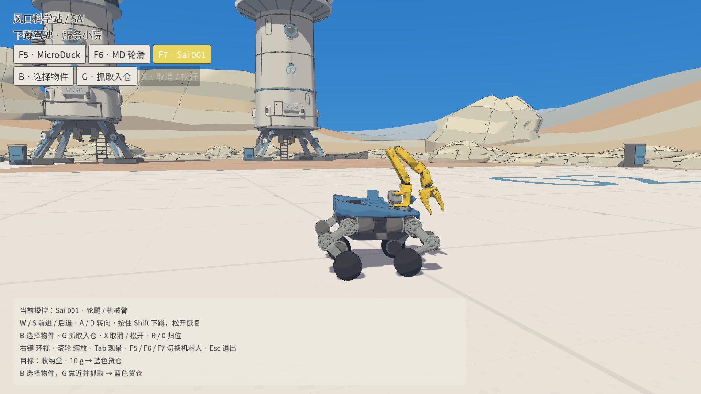

# Sai 001 驾驶配置同步 · 2026-09-14

科学站与场景选择入口已同步「修复小狗机器人腿部抖动」任务中验收的 Sai 001 驾驶行为。

## 核对结果

科学站的防抖模型原本已经是 `sai-flat-motion-v1`，与该任务的部署权重逐字节一致：

`094adb4484b3d812dfb8a056491beda34a23fd0fa6f463b7784854ebc354d53d`

落后的是驾驶代码。科学站工作目录停留在默认 0.16 m/s 的版本，没有后续的车轮路径扫描、高速蹲行和倒车转向转换。修改前实际科学站按 W 的速度为 0.1622 m/s；新验收能明确识别旧速度和未接通的扫描，见 [修改前回放](before.json)。

## 当前行为

- 自由驾驶 W/S 默认请求 ±0.5 m/s，按住 Shift 保持相同巡航速度。`--drive-speed .16` 可显式选择原低速。
- 倒车 S+A 时车尾向左、S+D 时车尾向右。前进和原地转向保持原行为。
- 使用沿车轮路径的 15 条实际碰撞射线判断是否需要爬阶；发布 actor 的 24D 地形观测保持原合同。
- 地形与课程台阶具有独立扫描层，科学站的三角形缓坡参与扫描。建筑和设备继续具有原物理碰撞，但不会被地形射线误当作整片地面升高。
- 蹲行优先滚过小接缝；遇真正台阶先停稳，提示松开 Shift 后爬阶。明确选择的台阶课程保留原低速和专用策略。

本轮同步的是 Sai 001 已验收行为，平地 ONNX 字节、电机、物理步长、台阶和载货权重均未修改。来源目录还包含其他机器人及搬运开发，本轮没有用整目录覆盖科学站。

## 验证

[科学站驾驶](science-driving.json)和[维修站驾驶](workshop-driving.json)共 16 项实机物理回放通过，覆盖 W、W+Shift、S+A、S+D、两种倒车转向叠加 Shift、W+A、原地 A；每项检查持续输入、实际速度与转向、腿部速度、轮高、姿态、松键停车、实际策略哈希和地形扫描连接。

科学站直行实测 0.4819 m/s，蹲行 0.5044 m/s；对应腿部关节速度 RMS 均低于原有 0.5 rad/s 门槛，轮高低于 12 mm。这里报告仿真测量，不代表真实硬件极速。

[五条科学站路线、抓取、取消、切换复位及旧维修站回归](scene-checks.json)共九组通过；旧维修站保留的 17 项检查均通过。[几何与扫描层](geometry.json)、[实际 20 mm 上阶](up20.json)及[九项控制器/抓取单元回归](unit.json)通过。本轮没有重跑未改动的两种 MicroDuck 各自所有路线。

[当前版本近距离驾驶实录](current-driving.mp4)展示前进、Shift 蹲行和倒车转向。1920 × 1080 原生视口，按原始墙钟时间编码，没有变速。[录像与部署核验](video.json) · [源码与模型指纹](source-manifest.json)。

最终以每秒约十张原生画面采集，游戏最低/中位 30/30 FPS，仿真/墙钟比 1.0004；[直行动作质量](visible-motion.json)和[蹲行动作质量](visible-crouch.json)均通过。录制频率不是游戏渲染频率。

性能测量存在波动：[较早的未录屏测量](normal-earlier.json)为最低/中位 17/18 FPS、仿真/墙钟比 0.9153；[隔离旧配置对照](prior-runtime.json)为 30/30 FPS、0.9998。另两次未录屏测量因同期独立验收被资源检查中止或暂缓，未计为通过。本轮未单独确认这次性能波动的原因，因此只报告各次实际结果，不把最终录屏的 30 FPS 当作所有负载下的保证。



测试只发送正常按键，通过实际 Godot/Jolt 和 Python ONNX 控制链运行；自动路线不改写机器人位置。无窗口回放允许取消渲染帧率限制，保留 2000 Hz 物理与 50 Hz 控制。

## 启动与后续版本核对

应用菜单「风口科学站」仍指向本工作目录。退出旧游戏后重新启动会重新准备当前代码；R/0 只复位，不会热加载更新。新旧场景共用同一个驾驶入口。

```bash
./run-workshop.sh --scene science_station --robot sai
./run-workshop.sh --scene workshop --robot sai
```

每次实际建立 Sai 控制会话时，日志输出 `SAI_DEPLOYMENT`，包含平地模型 ID、SHA-256、驾驶版本 `sai-driving-20260913` 与加载模块路径；逐帧测试轨迹也保留模型哈希和驾驶版本。这样可以分别核对权重与控制代码，不能仅凭模型名称判断整个入口是否最新。

后续训练候选仍须先验收再更新固定权重及清单；不会从其他开发目录或训练输出中自动拾取未经验收的文件。

```bash
nice -n 10 taskset -c 10,11 .venv-sai/bin/python scripts/accept_science_sai_driving.py \
  --output results/science-station/sai-driving-check
.venv-sai/bin/python -m unittest tests.test_sai_terrain tests.test_workshop_grab
# 使用当前驾驶配置重新录制同一组按键
nice -n 10 taskset -c 10,11 .venv-sai/bin/python scripts/run_science_check.py \
  --scene science_station --robot sai --record \
  --plan docs/science-station/sai-sync-20260914/drive-plan.json \
  --output results/science-station/sai-current-driving
```

来源：用户引用的 Codex 任务 `01a0969b-6d50-7641-88b9-5f605e9e62d3`，及其工作目录中对应的已验收 Sai 001 实现。原始回放、失败记录和运行日志位于 `results/science-station/sai-sync-20260914/`。
