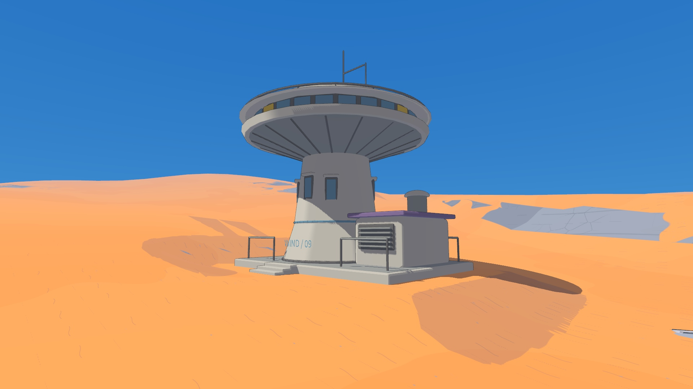

# 风口科学站：地表与场地

当前版本保留三种机器人的模型与控制，更新地形、地表材质和西侧气象台场地。

- 中近景的低坡、沟槽与沉积台缘直接构成连续地形；显示和碰撞共用三角面。移除矩形石块围栏。
- 沙土与露岩采用明确的色块边界，铺装边缘有薄层积沙、局部磨损与接缝。道路两侧不使用宽渐变光晕。
- 保留远山原有高度和开放天际线，消除近远地面的接缝露空。可接近的站外岩体有真实碰撞。
- 西侧气象台落在整平地面上的低矮基础上，配入口踏步；移除建筑下方的巨石和长支撑。
- 20 × 12 米设备泊位、三个安全点与六件物件保持原有布局。



[侧面](outpost_side.jpg) · [背面](outpost_back.jpg) · [八张场景截图](../media/) · [15 秒 PV](../media/sai-windpass-15s.gif) · [1080p 影片](../media/sai-windpass-film.mp4)

## 验证

[完整原生回归](acceptance.json) **25 / 25 通过**：三种机器人的主环路、缓坡、塔底、实验舱与北侧路线；切换、复位、三个互动区全部六件物件抓取入仓、取消、物件互动及旧维修站回归。

[几何检查](geometry.json)覆盖 30 块地形、共享边界、地表高度、平整泊位、实验舱门洞、塔底通道、地形与建筑遮挡、外围碰撞、气象台场地及基础。

[正常运行记录](runtime.json)：DGX Spark／GB10、Godot 4.7.2 Forward+、1920 × 1080、30 FPS 上限、两个固定 CPU 核、nice 10。三种机器人正常移动时的最低／中位帧率均为 30 FPS，仿真／墙钟比为 0.9999–1.0015。数据剔除前三秒启动阶段；这是正常游玩结果，视频采集开销另行记录。

轮滑缓坡回放曾因加密网格后重新采样坡面而失稳。同一回放两次复现；改为细分既有坡面而不改变接触形状后通过。策略、物理参数与路线判定未调整。[接触诊断记录](terrain-contact.json)。

外围岩体的三角碰撞合入现有静态场景体，避免逐块分配新的物理体改变机器人与物件的分配顺序。一次原生主环路回放在独立岩体版本中失稳；合并后全部 2144 帧观测与原通过版本逐项相同，路线恢复通过。[静态场景碰撞诊断](scenery-contact.json)。

地表大三角色斑的本机 A/B 检查将问题定位到旧浮点正弦哈希；用整数哈希替换后，同一视口的噪声场连续。材质边界仅保留像素尺度抗锯齿，不以宽模糊掩盖接缝。

## 模型与媒体

实机日志确认 Sai 使用 `sai-flat-motion-v1`，SHA-256 为 `094adb4484b3d812dfb8a056491beda34a23fd0fa6f463b7784854ebc354d53d`，驾驶配置 `sai-driving-20260913`，默认 0.5 m/s。同步主分支新增的 MicroDuck 实测速度 HUD；没有替换任何已验收权重。

PV 使用本版本四个固定机位：服务小院移动、样本站提起物件、穿行双塔及西侧缓坡。原生 1080p 图像按墙钟时间剪辑，输出 15 秒、960 × 540 GIF 与 1080p MP4。高清源帧约 15 Hz；MP4 30 FPS／GIF 12 FPS 采用最近记录帧，没有运动插帧或加速。[剪辑配方](../pv-edit.json)和[逐镜头验证](../media/pv-validation.json)随仓库交付。

首页只展示 PV、运行入口和 SIM2SIM 功能；场景设计与验证保存在本目录。

样本站抓球回放还暴露了原有辅助抓取的下降过量：夹爪提前接触后继续下降，将球压穿薄地形。现在保留抓住时的物件高度与接触偏移，限制剩余下降；物件仍由 Jolt 约束与接触力移动，没有修改位置或关闭地面碰撞。[抓取高度诊断](grasp-clearance.json)。

## 启动与复现

```bash
./run-workshop.sh --scene science_station --robot sai
./run-workshop.sh --scene workshop
```

完整按键见[场景说明](../../science-station.md)。录制计划在 [plans](plans/)；验收命令支持 `--runtime-dir`，可复用单独的运行缓存而不覆盖桌面会话。

```bash
nice -n 10 taskset -c 8,9 .venv-sai/bin/python scripts/accept_science_station.py --share-resources --runtime-dir results/science-station/terrain-20260914/runtime --output results/science-station/terrain-20260914/acceptance-release
```

高频细线与实时阴影在远距离仍会受采样影响。固定白昼、自由探索和现有物理交互是本版范围；上层建筑、大型载具与新训练策略尚未实现。
