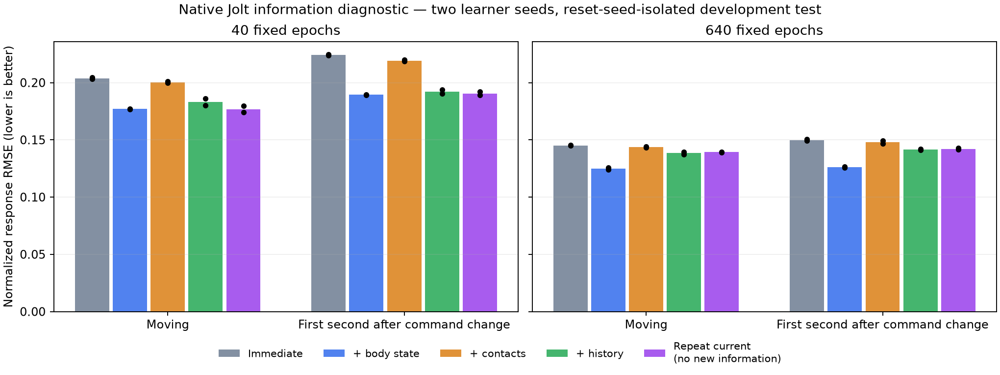
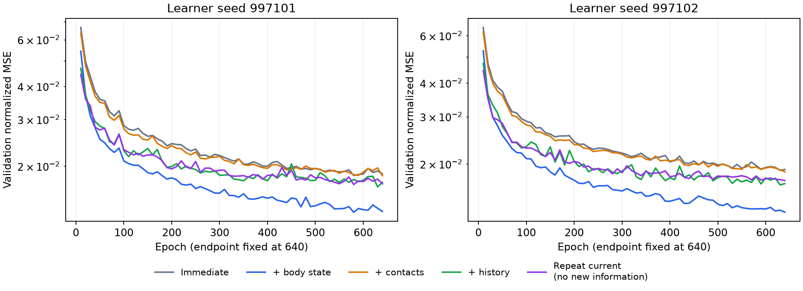

# Jolt 信息诊断与 GPU 同动作回放，2026-09-13

**本轮没有训练或替换新的机器人策略。** 完成了 20 个 CUDA 动力学预测器、冻结失败回放和同动作 GPU 物理对照。结果不支持立即引入历史／接触 actor；身体速度与高度有预测价值，但尚未证明能修复操控失败。加速目标仍未完成：此前较好的 a402791 候选仍为 127/128 加速、128/128 普通、7/7 回归，零跌倒，默认模型与安装包保持原样。

会话为 `results/sprint_observability_20260913/`，基准提交 `32097eb`。本轮只用了已有开发数据，最终种子 **928000–928049 未使用**，宿主物理键盘验收未重新进行。

## CPU 和 GPU 分别做了什么

用户看到四个 CPU 核心满载的疑问是合理的。[上一轮](../sprint_target_gpu_20260912/RESULT.md)采用真实 Godot/Jolt 收集训练数据、GB10/CUDA 更新网络：每组约 279 秒采样、37 秒重建、1.4 秒更新，整体受 CPU 采样限制，不能称为全 GPU 训练流水线。

更早的大规模训练已使用 CUDA 物理采样和 CUDA 学习。之后发现并修复的是**训练代理与游戏的关节速度／阻尼契约差异**，没有发现 GPU 算术故障；修复后的代理仍不能完整复现目标引擎中的失败，因此才进行了少量原生校正。

本轮信息诊断复用了现有轨迹，数据提取约 **18.87 秒**；两组各十个预测器的学习任务分别约 **18.84 秒、259.43 秒**，均在 CUDA 上执行。保存的资源快照显示整体 GPU 利用率 44%，学习进程约 933 MiB，CPU 限在 16–19、nice 10；这只是一次设备快照，不是持续利用率或独占 GPU 吞吐量测试。程序在 CUDA 不可用时直接失败，不回落到 CPU。原生新回放只有五个复现／消融回合，另有代码回归所需的短物理测试。

## 冻结失败与数据边界

将 `sprint_alternate / 927001` 从 18 秒缩到 9 秒，保留等待、前进、左转、反向右转。三次独立原生回放的第二段转向响应均为 **0.376726 rad/s**，低于原有 0.48 门槛，均没有跌倒。首 9 秒的观测、动作、上一动作、命令和控制目标与原始轨迹最大差均为零。

去掉开头一秒等待，或去掉第一次左转，该缩短用例通过。这是到达失败段之前的轨迹影响结果的证据；没有把删去操作当作游戏修复，也没有证明某种接触缓存是唯一原因。

信息诊断使用 1,856 个已有原生回合，涵盖 31 个不同加速权重哈希。按**完整复位种子**划分，所有策略版本、课程和噪声副本保持在同一侧：

| 分组 | 回合 | 采样转移 | 不同复位种子 |
|---|---:|---:|---:|
| 训练 | 672 | 135,996 | 36 |
| 验证 | 288 | 58,284 | 12 |
| 开发测试 | 896 | 181,328 | 16 |

训练／验证来自三组既有校正轨迹，验证选 `seed % 8 == 2`，已知困难种子 927001 全部从两组排除。测试为此前七个固定候选的 927000–927015，去掉重复的普通控制回合。896 回合不是 896 个独立初态；置信区间按 16 个复位种子成组重采样。开发数据已经用于之前的研究，不冒充最终保留集。

预测当前动作执行后 20 毫秒的变化：当前朝向坐标系内 COM 速度增量，以及世界竖直轴角速度增量。输入只取动作前状态；历史为之前 1、2、4、8、16 个决策步，覆盖 20–320 毫秒。每四行采一个训练样本，但响应仍是下一行的 20 毫秒结果。最后一行因缺少下一行而排除。输入和目标只用训练集求归一化参数；专门测试了未来帧不得进入当前输入、历史索引及坐标转换。

## 新信息与优化差异必须分开

五组都用 387→128→128→3 的 SiLU 网络，相同学习种子、初始权重、打乱顺序和优化器。即时组只看 61 维观测及当前 14 维动作，其余输入屏蔽；另外分别打开身体速度／高度、双脚接触与冲量、五段观测历史。第五组将当前观测重复填到历史位置，**不增加信息**，用于检查输入展开带来的优化差异。

第一组固定 40 epochs。身体状态相对即时组降低约 13%–16% 误差，但重复当前观测也有相近改善。原始机器结果的 `information_gate_passed` 是当时只相对即时组的初筛字段，**不能解释为新信息已经成立**；无新信息对照本身就通过该初筛。

因此另立协议，所有五组、两个种子都从相同初始权重训练至固定 **640 epochs**，没有按验证曲线挑终点。第二组同时要求胜过即时组和重复当前观测组；在移动、命令变化后一秒两个子集都至少降低 10% RMSE，各输出分量不回退超过 2%，两种学习种子均通过，成组 bootstrap 的改善下界大于零。仍使用同一开发测试集，属于后续诊断，不是独立确认试验。

| 640 epochs，两个学习种子的平均归一化 RMSE | 移动 | 命令变化后一秒 |
|---|---:|---:|
| 即时观测＋动作 | 0.14514 | 0.14980 |
| ＋身体速度／高度 | 0.12481 | 0.12602 |
| ＋接触信息 | 0.14359 | 0.14797 |
| ＋短时历史 | 0.13838 | 0.14163 |
| 重复当前观测 | 0.13921 | 0.14207 |

身体状态相对重复当前观测，移动误差分别改善 **9.80%、10.90%**，过渡误差改善 **10.56%、12.03%**。一个学习种子的移动项未达到预设 10%，因此完整门槛没有通过；不能把接近门槛改写成合格。历史相对该对照只有约 −0.4% 至 1.3% 的变化，接触更差，当前没有足够依据改为历史或接触策略。

事后进一步查看此前 14 个失败段，共 389 个采样点。身体状态的整体预测更好，但原始 927001 转向段只有 25 个点，两个学习种子分别出现改善和恶化。这个小样本分析不参与选终点，也不能证明加状态就会修复该失败。[早先状态可见／屏蔽的策略试验](../sprint_exit_20260912/RESULT.md)为 117/128 与 124/128，本轮没有推翻那项负面策略证据。

## 同一个动作，两个仿真的响应仍不同

额外固定 16 条原生交替转向轨迹的前 9 秒，把实际执行的动作直接送入 CUDA 物理代理。两边都不重新选动作，不运行策略反馈；只比较旧求解器速度与已修复的 `joint_fd` 速度路径。采用实际 Jolt 脚底、已有转子映射和原生零速度初始位姿，之后不再移植或冷恢复状态。

初始完整观测最大差 **3.55e-15**，整个动作带对应的控制目标差为 **0**，上一动作历史差为 **0**。以下为 16 个初态的误差中位数：

| 时间／指标 | 旧速度路径 | 已修复 joint_fd |
|---|---:|---:|
| 20 ms，关节位置 RMS | 0.000564 rad | 0.000019 rad |
| 20 ms，朝向误差 | 0.0250° | 0.000145° |
| 100 ms，COM 速度差 | 0.04425 m/s | 0.04477 m/s |
| 1 s，机身位置差 | 0.654 mm | 0.636 mm |
| 1 s，关节位置 RMS | 0.00798 rad | 0.00767 rad |

修复速度契约明显改善了最初 20 毫秒的响应，但没有消除后续动力学差异。持续开放动作回放到 3 秒，两组位置偏差中位数均约 0.25 米。**长时偏差包含开环误差累积，不能当作闭环策略质量、局部接触误差或某个求解器好坏的指标。** 初始可见观测一致也不等于内部约束／接触状态完全相同。

这项检查进一步区分了“模型在 GPU 上计算”与“GPU 训练环境是否充分代表游戏”。后续可复用动作带，将短时响应误差按落地、支撑、换脚分解，再对训练代理做有对照的标定；游戏 Jolt 及执行器参数继续冻结。仅靠增加 actor 历史，当前缺少支持。

## 验证、交付限制与恢复

本轮新增因果特征提取、固定 GPU 预测实验、两个输入对照和物理动作带诊断。代码回归、精确工时、默认模型／物理哈希及进程终态在 [RESULT.json](RESULT.json)。首次广泛回归错误继承了新会话数据目录，使 19 项测试找不到封存的 baseline 文件；保存失败记录后，清除该环境覆盖再运行。没有通过改变测试断言掩盖问题。

预测器是研究模型，不是可运行的 14 维动作策略。本轮没有新安装包，没有宣称动作质量改善或达到 MuJoCo 水准。复现使用 [REPRODUCE.md](REPRODUCE.md) 中对应版本，禁止把旧目录存在当作尚需启动的任务。20 个预测器、数据及原始失败尝试保留在本地并记录哈希；收尾只提交本轮代码和证据，其他任务修改保持原样。

封存工时 **45.213 分钟**，其中开账前 5 分钟为显式估计，之后按确认心跳和任务时间并集计时；最终校验／Git 记账未计入该截止值。12 个监督任务均有终态，11 个成功、1 个为已保留的测试环境失败；无残留 Godot 或学习进程，账本 actors 为空。回归 **295 项，293 通过、2 可选跳过**。73 个本地原始数据／研究权重文件合计约 **669.8 MB 逻辑大小**，未重复复制此前采样数据；默认模型及物理 15 项哈希保持不变。
