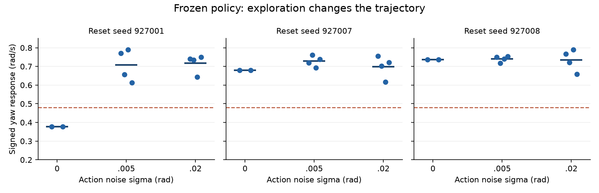

# 原生轨迹的 GPU 校正学习，2026-09-12～13

**本轮没有合格的新模型。** 三组训练、六个固定终点均完成了原样 263 条原生开发验收，最好仍为 127/128 加速；所有终点都丢失了起点原本成功的用例。默认模型和安装包未更新，最终种子 **928000–928049 未使用**。左 Shift+W 更快、直行稳定、转向及停止均可靠的完整目标仍未完成，也没有证明达到原版 MuJoCo 水准。

本轮交付的是可验证的目标引擎采样／CUDA 学习实现，以及改变后续研究方向的证据。开工基准为 `b20a33d`，会话 `results/sprint_target_gpu_20260912/`，90 分钟上限，最后 20 分钟预留收尾。准确工时、源文件哈希和运行终态见 [机器结果](RESULT.json)。

## 固定对照结果

三组均从上轮 GPU 关节观测对齐后的 **a402791** 模型及对应 critic 出发，每组 12 批、每批 32 个完整回合，共 **316,800 条转移**；前两批只适配 critic。每组预先声明第 6、12 批为检查点，没有根据最终保留集选择参数。普通槽始终为冻结 S05，游戏 Jolt、200 Hz 物理／50 Hz 决策、执行器和控制配置不变。

| 方案／终点 | 加速通过 | 普通通过 | 已知回归 | 跌倒 | 长直行速度 | 相对普通 |
|---|---:|---:|---:|---:|---:|---:|
| 起点 a402791 | 127/128 | 128/128 | 7/7 | 0 | 0.23250 m/s | +20.33% |
| 全程探索，第 6 批 | 125/128 | 128/128 | 7/7 | 0 | 0.23265 | +20.41% |
| 全程探索，第 12 批 | 125/128 | 128/128 | 7/7 | 0 | 0.23253 | +20.35% |
| 确定性前段课程，第 6 批 | 127/128 | 128/128 | 7/7 | 0 | 0.23334 | +20.77% |
| 确定性前段课程，第 12 批 | 126/128 | 128/128 | 7/7 | 0 | 0.23364 | +20.92% |
| 前段课程＋保留初始模型，第 6 批 | 125/128 | 128/128 | 7/7 | 0 | 0.23328 | +20.74% |
| 前段课程＋保留初始模型，第 12 批 | 127/128 | 128/128 | 7/7 | 0 | 0.23158 | +19.86% |

六个终点的普通速度均与冻结 S05 对照一致，八组配对加速速度门均通过；否决来自真实操控回退，不能用速度或零跌倒掩盖。

- 全程探索第 6 批保留了原交替转向失败，并新增两例同类失败；第 12 批修复了原失败，却新增一例转向不足和两例停步超时。
- 确定性前段第 6 批修复原失败，但 `sprint_right / 927004` 在转弯后直行的横向偏移为 **5.437 cm**，超过 5 cm 门槛；第 12 批出现两个新的交替转向失败。
- 保留初始模型第 12 批只剩 `sprint_alternate / 927013`，但其转向响应 **0.3206 rad/s**，低于 0.48 门槛。起点在这条用例通过，因此仍不能晋级。

逐条前后对照、失败指标和轨迹路径见 `evidence/native_*/comparison.json`、`episodes.json`。起点与所有候选使用同样的开发种子 927000–927015、命令和物理；不把不同种子或不同控制版本拼成改善率。

## 查实的训练／运行差异

全程探索的 48 条交替转向训练轨迹中，有 5 条低于该段转向门槛；不是完全没有失败样本。但固定起点模型和原失败初态 927001 后，出现了更具体的现象：

| 动作噪声标准差 | 同初态重复数 | 该段转向不足 | 平均诊断转向响应 |
|---|---:|---:|---:|
| 0 | 2 | 2 | 0.3770 rad/s |
| 0.005 rad | 4 | 0 | 0.7075 rad/s |
| 0.02 rad | 4 | 0 | 0.7173 rad/s |

图中横线为各组均值，虚线为该段 0.48 rad/s 门槛；每组只有 2／4／4 次重复。这是从身体四元数直接计算的**诊断量**，与完整评分器的数值有小幅投影差异；这些探索轨迹全部不能用作验收。所有模型、初始位姿和物理保持固定，改变的是从开局施加的动作噪声。

因此，噪声会改变到达转向段时的真实轨迹。较小的 0.005 噪声也没有覆盖这个确定性失败，直接降低噪声继续训练缺少足够依据。本实验没有测定具体是哪一个接触缓存或步态机制导致变化，不能把它写成已确定的唯一物理根因。

## 针对证据实施的两项对照

**确定性前段课程。** 一半回合保持原本的全程探索；另一半使用已知开发失败 seed 927001 和一个新复位种子，先确定性运行到 7 秒，再在加速段加噪声。所有八个课程保留；这是“确定性前段＋困难初态混合”的联合课程，不能把效果只归因于其中一个因素。

原生检查证明，在原失败用例的前 7 秒，观测、动作、上一动作、控制命令和控制目标均与确定性回放**完全一致**，探索入口的观测也一致。没有冷状态移植、冻结刚体或自动复位。每批 4,400 条确定性加速记录只参与 critic 估计，不能作为随机动作做 PPO；实际策略梯度样本为每批 11,600 条。课程能修复原失败，但未消除回退。

**保持约束的参照。** 原保持损失约束的是“当前残差相对 S05 的均值偏移”。目标引擎校正时，它持续把加速策略往较早的 S05 拉回；普通行走槽本身却已冻结。第三组只把保持参照换为冻结的校正前 a402791 残差，保持教师输入数据、权重、课程、优化参数和起点相同。教师深拷贝后无梯度，初始保持损失为零。两组首次 actor 更新之前的 96 个回合、79,200 帧观测／控制轨迹完全一致，配对检查通过。

更换参照仍未达到完整门槛，**不能将旧教师视为唯一瓶颈，也没有证明新参照普遍更好**。新能力为显式选项，原有保持方式仍是默认值。

## 实现与计算资源

新增原生完整回合采样、动作后状态奖励重建、约束回报、确定性前段屏蔽以及 CUDA 校正学习。真实轨迹逐批验证控制命令、上一动作、策略均值、普通槽输出、噪声分布和导出动作误差。有限任务的最终状态参与奖励，最后一帧终止；跌倒后的恢复帧和补齐帧不进入更新。最大导出误差小于 **2.2e-6**，低于 1e-5 门槛。

三组共 **950,400 条目标引擎转移**、1,152 个完整训练回合，训练回合均无跌倒。采样在四核 CPU 的原生 Godot/Jolt 中执行，网络更新在 GB10/CUDA 中执行；Python 只编排完整回合和离线处理，不通过 TCP 控制游戏单步。这一轮确实使用 CPU 收集训练数据，不能称为全 GPU 采样。各组约 279 秒采样、37 秒重建、1.4 秒 GPU 更新；这是补充既有大规模 CUDA 预训练的目标引擎校正试验，没有发现 GPU 算术故障。

六组正式原生验收共 1,578 个回合，在训练全部停止后分别测量。没有把随机探索回合当成确定性性能，没有因接近门槛而改评分器。代码回归 **292 项，290 通过、2 项可选跳过**。

## 下一步的依据与限制

这组固定预算试验没有支持“再加几轮同样的 PPO 就能稳定改善”。后续应先比较失败与相近成功轨迹的可辨识性：用现有即时观测、加入真实接触信息、加入短时观测／动作历史，分别预测动作后的转向与停止响应，在完整回合分离的开发数据上检验。只有额外信息明确减少失败段的预测歧义，再决定是否改变 actor 的输入或记忆结构；这仍是待验证方向。

**不能直接重做“增加速度／高度”并当作新思路。** [早先状态消融](../sprint_exit_20260912/RESULT.md)已比较过同源同预算的可见／屏蔽状态，结果为 117/128 与 124/128，未支持简单扩维。那次只有单帧信息、较早训练起点和有限预算，也没有证明短时历史无用。恢复研究时应先核对这项旧证据及本轮完整确定性轨迹。

本轮没有生成新安装包、没有运行最终保留集或重新验证宿主物理键盘。`freeze_candidate.py` 是未执行的准备脚本；无合格候选时会在创建交付目录之前拒绝。checkpoint 保存策略、critic、优化器、约束尺度及随机状态，但本轮没有核定新校正路径的中断续训连续性，当前 CLI 也不提供通用 `--resume`；不能仅凭 checkpoint 存在宣称自动恢复已走通。

运行复现、版本选择和临时目录恢复说明见 [REPRODUCE.md](REPRODUCE.md)。本轮完整用户目标仍未完成。

## 封存与清理

账本至报告封存为 **74.521 分钟**，低于 90 分钟上限；其中开账前 3 分钟是显式准备工时估计，其后按心跳与受监督任务的时间并集计时，并行不重复累计。最终校验值和 Git 记账操作未计入该截止值。账本 actors 为空，无未确认时间缺口。

11 个受监督任务均正常终止，资源审计未发现本轮残留进程；核验时无 Godot 或运行容器，远程桌面服务未触碰。11 份临时 runtime 比对并保留差异后删除，约 **14.10 GB 逻辑文件大小**（不等于实际回收磁盘量）；2,852 个本地数据／模型文件约 17.27 GB 保留并登记哈希。默认模型和物理的 15 项校验通过。只提交本轮代码、记录及 HANDOFF，其他任务的修改保持原样；未推送远端。
