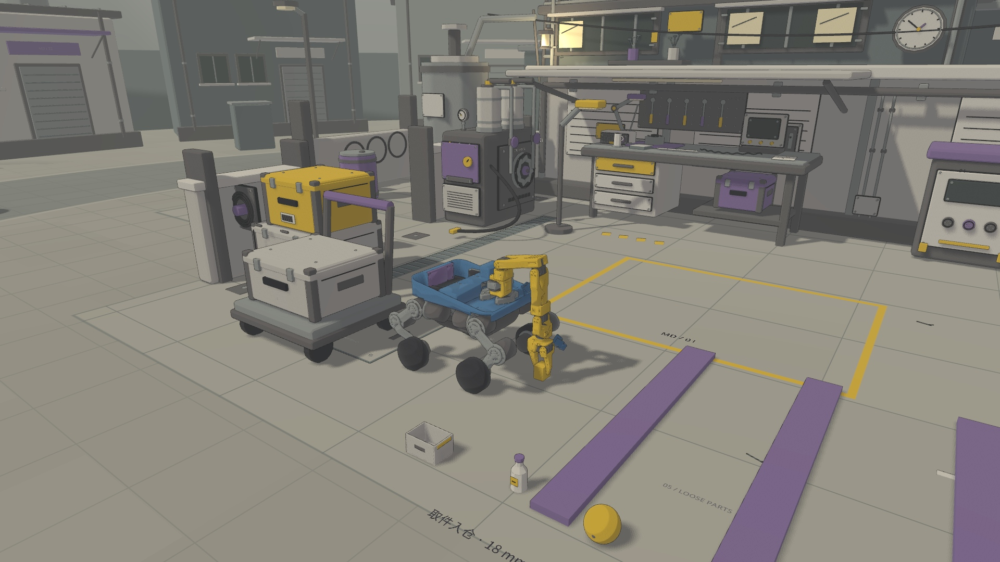
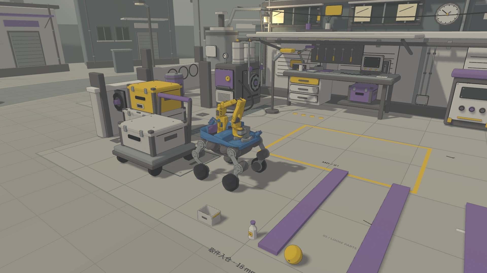
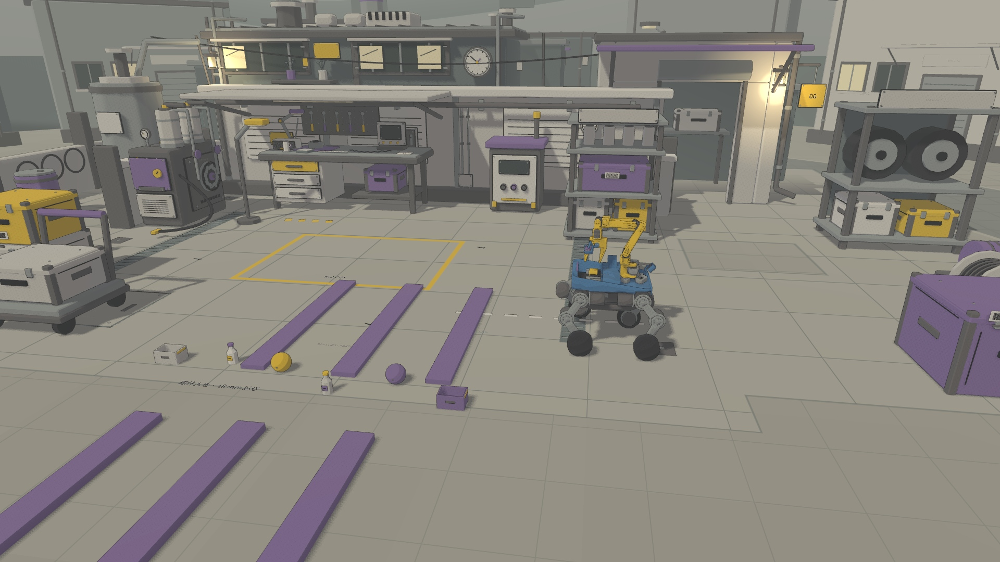
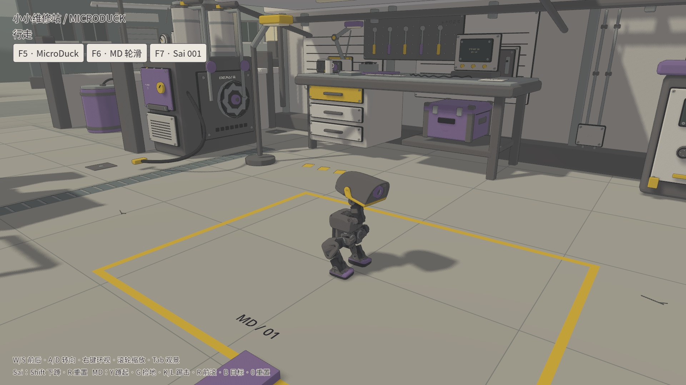
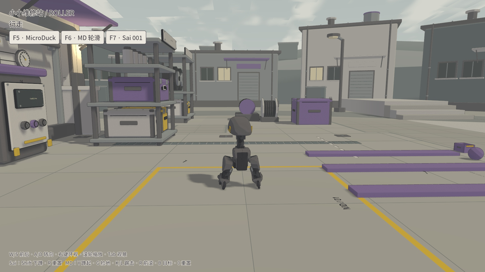

# 小小维修站 / Sai 001 接入验收

2026-09-12，Ubuntu 24.04 ARM64 / NVIDIA GB10，Godot 4.7.2 Forward+ / 内置 Jolt。仓库已更名为 [Robot_Godot_Sim2Sim](https://github.com/sgyli7/Robot_Godot_Sim2Sim)。[一键启动与资源准备](../workshop-hub.md)。

## 已实际运行

| 项目 | 结果 |
|---|---|
| 三机器人动态切换 | 通过。可见窗口 PID 356270 中 MicroDuck → 轮滑 → Sai → MicroDuck，维修站与六件松散物件实例不变；每次切换前后物件位置逐项相同 |
| 重复切换与复位 | 通过。49 秒输入回放共六次切换/复位，始终同一个 PID 346567；16 / 19 / 26 刚体分别正确加载 |
| MicroDuck 行走与前滚 | 通过本次操作回放。步行段无跌倒，R 启动前滚并恢复直立；R 没有被 Sai 复位快捷键覆盖 |
| MD 轮滑与蹲起 | 通过本次动作回放，无跌倒；推进超过 0.8m，Y 启动轮滑蹲起。没有因此宣称既有制动质量问题已解决 |
| Sai W/S、A/D | 通过正/反向位移和两方向航向变化检查 |
| Shift 按住/松开 | 高度由约 222.5mm 降至 183.7mm，松开后恢复约 219.3mm |
| Sai R 复位 | 通过，同窗口重新加载初始状态 |
| 20mm 上 / 下阶 | 全部四轮越过四级台阶，停止保持 3 秒；13.28 / 12.30 秒完成 |
| 40mm 上 / 下阶 | 同一发布版完整检查通过；19.54 / 11.56 秒完成 |
| 60mm 实验上 / 下阶 | 使用 alpha.3 配对实验策略；27.34 / 16.22 秒完成。仍标注实验能力 |
| 100g 抓取入仓、18mm 运送 | 发布版完整检查通过。71.34 秒完成，运输 2.70m，物体始终由接触与受力移动；运输 44,000 次物理检查零出仓、零失夹 |
| 25mm 运送 | 发布版完整检查通过，运输 2.61m；见货物报告。不能外推为任意负载越障能力 |
| 独立发布检出启动 | 三机器人循环加载通过，资源准备脚本成功生成九模型 / 两机型清单 |

[17 项操作检查](controls-result.json) · [六种台阶的逐项判据](stairs.json) · [可见窗口切换身份记录](visible-final.json) · [发布检出运行](publish-smoke.json) · [首次 18mm 货物报告](movie-release.json) · [25mm 货物报告](cargo25-release.json) · [模型与代码校验](provenance.json)

这些是固定初态、固定输入的单次集成验收，不是多种子成功率评估。按键回放通过 Godot `InputEventKey` 输入通道，不能代替宿主操作系统的人工键盘验收。

## 物理与场景边界

复用已合并 PR #4 的 Sai alpha.3 提交。26 个刚体、23 个铰链、2 个滑块，SO101、四轮机械腿和开放蓝色货仓保持原结构。MicroDuck 原生控制器加载现有九个模型。材质只重设视觉网格的着色，未增加机器人碰撞体或改质量、电机增益。

同一进程切换时，MicroDuck 采用其 200Hz / 32 次速度迭代 / 零 speculative contact distance；Sai 采用 2000Hz / 10 次迭代 / 0.5mm speculative distance。Jolt 的空间构造函数复制求解设置，因此必须在切换时创建新物理空间，再迁移同一批维修站节点。[Godot Jolt 空间实现](https://github.com/godotengine/godot/blob/4.7.2-stable/modules/jolt_physics/spaces/jolt_space_3d.cpp)。

Sai 节点移动到工位后，对工具 FK 坐标、地形射线和报告中的物品/轮缘坐标做原点换算。`robot.gd` 电机、刚体与接触实现直接来自发布包；策略输入仍处于发布版的局部米制坐标。货仓传动仍是发布版的弹性带力级近似，未经硬件标定。

## PV 与游戏截图

[15 秒 1080p PV](../media/sai-workshop-15s.mp4) · [剪辑和速度清单](../media/sai-workshop-15s.json) · [新版原片 / 完整轨迹](https://github.com/sgyli7/Robot_Godot_Sim2Sim/releases/tag/workshop-pv-stable-20260912)

PV 已重新实录为固定机位版：前三段用固定近景，运输段直接切到固定远景，机位内没有跟随、旋转或缩放。分为抓取、移入蓝色货仓、收臂夹紧、夹紧越障运输四段。原片使用 Godot 视口的真实墙钟时间戳编码；加速发生在视频剪辑中，各段倍率印在画面上。首页保留原 MicroDuck GIF，并在其下增加 Sai GIF。

固定机位重录再次通过完整货物检查：71.34 秒仿真、约 74.13 秒原片，运输 2.70m；44,000 次运输物理检查零出仓、零失夹。1,591 帧中，近景 1,095 帧、远景 496 帧，各自仅有一个相机位置/朝向/焦距组合。[本次重录验收](movie-stable.json)。











## 尚未验证与已知限制

- 未验证真实硬件、其他平台、长时间连续切换、随机货物位置/形状/质量，以及任意转向角进入台阶。60mm 仍是实验技能，40mm 下阶本次横向偏移已接近 0.30m 验收边界。
- 货物任务依赖已知工位与物体模型；地形观测是射线高度扫描。没有验证相机识别、VLA、任意目标自主抓取或任务级导航。
- MicroDuck 九技能模型与按键保留；本轮只重新运行行走、前滚和轮滑蹲起，其他技能不新增通过声明。
- 可见窗口正常退出时，Godot 4.7.2 仍会输出一条 `scenario_remove_viewport_visibility_mask: scenario is null` 资源释放诊断，最终启动器退出码为 0。该诊断未在机器人切换过程中触发，尚未消除。退出资源释放的一个中间试验发生过崩溃，已撤回该试验；发布 PV 使用撤回后重新录制且正常退出的完整任务。
- 切换暂停中重新创建机器人；任务完成后保留结束画面，R 或选择任务可继续。没有把任务失败自动恢复混入验收轨迹。

## 复现

```bash
./run-workshop.sh --headless --plan docs/workshop-hub-20260912/plans/controls.json --output results/check-controls
.venv-sai/bin/python scripts/accept_workshop.py results/check-controls --out results/check-controls/acceptance.json
./run-workshop.sh --robot sai --task cargo18 --plan docs/workshop-hub-20260912/plans/movie-stable.json --record --output results/new-movie
# 使用具有 av / Pillow 的媒体环境：
python scripts/build_sai_workshop_pv.py results/new-movie
```

原始运行保留在 `results/workshop-hub/`，归档提供原片、完整货物与控制轨迹、台阶原始样本、运行日志及输入计划。原始 JPEG 序列保留在录制机器本地。
