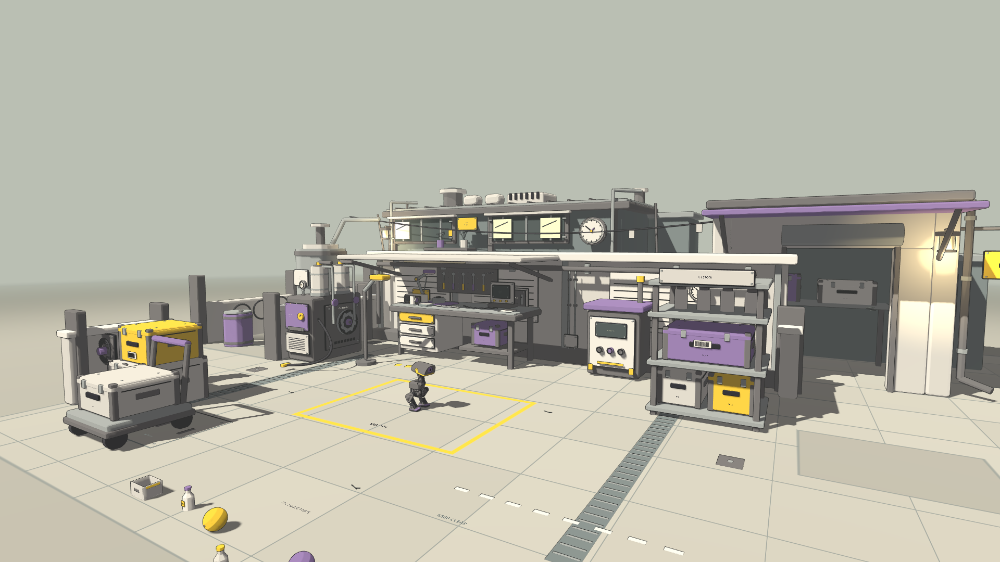

# 小小维修站：机械小院

在 MicroDuck 的石墨灰、黄色功能件与紫色点缀之下，补齐维修站背后的日常机械生活。
氛围参考 [Amanita Design《机械迷城》](https://amanita-design.net/games/machinarium.html)；本次几何、招牌、文字与布置均为自行制作，没有提取原作素材。

## 布景

- 后排低矮工坊：窗框、亮暗不同的玻璃、窗台盆栽、压力表、旧招牌、检修梯、屋面补片和通风器。
- 配件领取间：紫色雨棚、卷起的门帘、暖色笼灯、告示和内置零件货架。门洞真实开放。
- 两侧旧设备：储气罐与阀门、配电柜、备用皮带、收纳桶、旧轮胎架、退役电机和线缆卷。
- 桌面生活痕迹：茶杯、维修账本；上方电缆和标记牌把各设施联系起来。
- 侧院与后巷铺装延伸到新增建筑下，地面仍是同一个高度的接触平面。

大件集中在边缘，中央维修坪、前方轻物体踢击区和左右出口保持可用。屋顶最高约 1.55 米，没有加入巨型结构。世界材质继续沿用原有色板和批次，两个局部暖灯不增加阴影贴图。

## 碰撞与隔离

新增建筑、墙、罐体、落地设备、收纳桶、轮胎、线轴和检修梯沿用可见几何生成凸碰撞。门洞由两侧门柱和顶梁组成；货架与工作台按支腿和层板分开，空隙没有被整体盒子填满。小标签、油漆线、灯笼护丝等微小装饰不单独参与碰撞。

碰撞在无画面模式中也生成；所有变更限于独立维修站，机器人关节、质量、模型、观测、控制频率、共享 Jolt 参数和默认平地场景保持原定义。原有六个 6–15 克动态物件和 B / 3 / 4 / 0 操作继续保留。

```bash
./scripts/play_atelier.sh
# 复现旧背景，用于同机位比较；六个动态物体仍保留
MD_YARD_DRESSING=0 ./scripts/play_atelier.sh
```

`--flat` 仍表示历史无场景道具碰撞演示；正常游玩请使用默认入口。

## 迭代记录

1. 固定六个机位，采集原背景；建立后排工坊、领取间、储气罐和零件架。
2. 发现装饰袋与墙面共面，把它移到有支撑的屋面，并补齐碰撞；添加少量检修、收纳和生活细节。
3. 通行测试发现侧围墙侵入左侧出口，缩短围墙并让立柱端面错开，保持出口和表面深度清楚。
4. 真实行走测试发现领取间入口靠旧墙太近；向右移开 27 厘米，消除原墙端部对进门路线的挤占。
5. 保留原始失败记录，最终结果与同机位画面见下面的验证文件。

## 复现检查

在独立检出目录中，依次执行；脚本沿用资源检查和预览锁，训练／评估占用无法可靠比较时延后运行。

```bash
source scripts/showcase_env.sh
.venv/bin/python scripts/validate_workshop.py
.venv/bin/python scripts/verify_workshop_isolation.py
.venv/bin/python scripts/verify_yard_policy.py
SIM2SIM_FORCE_GL=1 .venv/bin/python scripts/capture_workshop_atmosphere.py --before --tag baseline_new
SIM2SIM_FORCE_GL=1 .venv/bin/python scripts/capture_workshop_atmosphere.py --tag dressed_new
```

六个机位、同源模型 hash、原始视频时间戳与资源快照由采集脚本保存在 `results/atmosphere/`。实际行走记录只有测试开场的一次位姿设置，不瞬移、不施加额外力。靠墙测试只发前进指令；进门测试由测试脚本追加正常转向指令来保持朝向，相当于有人操纵转向，并非新增自主寻路功能。固定初态的通行不代表任意方向与速度的策略成功率。

## 最终验证

- 新增 **142 个**结构碰撞，总计 273 个；九类边界的实际射线检查通过，门洞、货架下方与左右出口无误封。
- 鸭子尺寸的自由刚体撞墙后停止，穿门过程没有碰到隐藏盒子。
- 原生行走模型靠墙产生 75 条接触记录，未穿墙、未摔倒；正常转向指令辅助下进入领取间，未接触门框、未摔倒。
- 仅持续前进时仍有偏航，最终蹭到门边；这是当前模型的限制，没有通过瞬移或修改策略掩盖。
- 中央站立连续 100 步与原平地场景的动作、关节与机身状态逐值一致。
- 六个轻质量刚体的静置、受力、旋转、冻结与重置检查通过；B 键完整轮换和 0 重置也通过。原静态阶梯模式检查继续通过。
- 实际生成几何的轴向共面重叠检查为 **0**。该检查不穷举所有斜面，另外人工查看了固定机位和运动画面。

在相同 OpenGL、1080p、30 帧采集条件下，记录的绘制调用由 468 变为 480，显存统计增加约 12.5 MiB。绘制提交的中位耗时由 0.939 毫秒变为 1.042 毫秒；这不是 GPU 总帧时，也不等同于 60 帧性能认证。6 秒实录共 178 个有效画面，采集器跳过 2 次抓帧，按真实时间戳编码。

已知的退出日志仍有两条 OpenGL 纹理未释放提示，旧背景采集也存在；本次没有修改共享渲染器清理逻辑。最终无画面回归没有引擎警告或错误。

[验证数据](workshop_atmosphere_validation.json) · [短片](media/yard-atmosphere.mp4)

| 机位 | 修改前 | 修改后 |
|---|---|---|
| 全景 | [前](media/yard-before-overview.png) | [后](media/yard-after-overview.png) |
| 正常游玩距离 | [前](media/yard-before-follow.png) | [后](media/yard-after-follow.png) |
| 小院 | [前](media/yard-before-courtyard.png) | [后](media/yard-after-courtyard.png) |
| 工作台 | [前](media/yard-before-workbench.png) | [后](media/yard-after-workbench.png) |
| 领取间通道 | [前](media/yard-before-lane.png) | [后](media/yard-after-lane.png) |
| 屋顶与窗台 | [前](media/yard-before-roofline.png) | [后](media/yard-after-roofline.png) |


