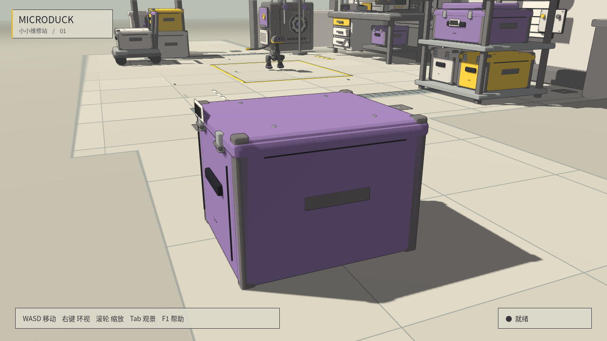
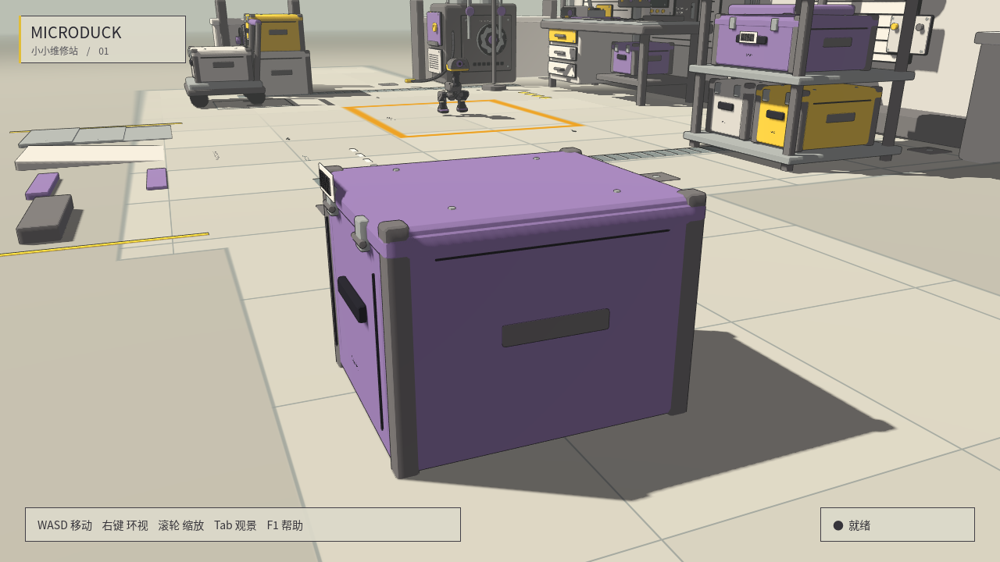
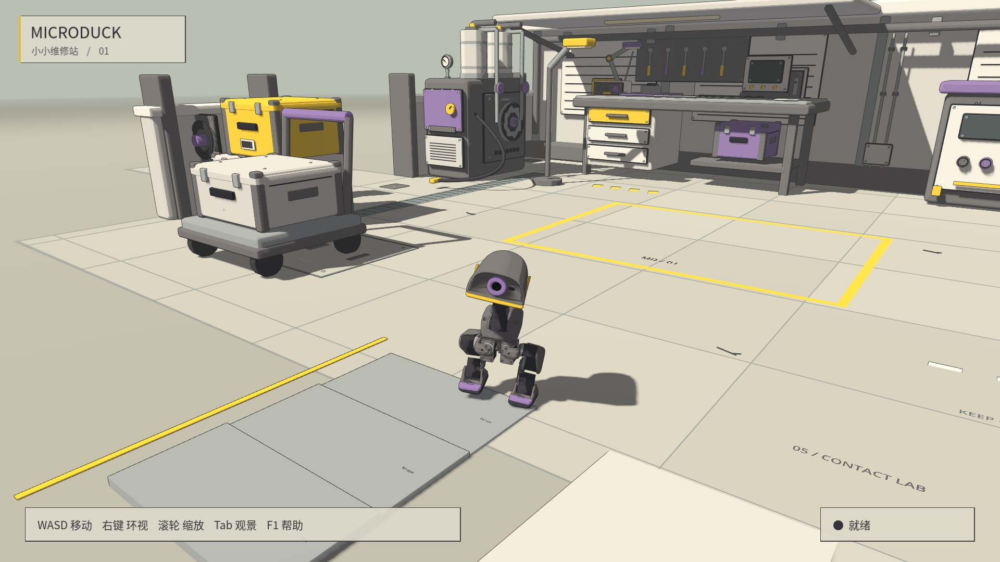

# 维修站：修复共面闪烁，加入真实接触

> 本页保留前一版静态台阶检查。最新默认试验区是可推动的箱、瓶、小球，见 [动态物件](loose_props.md)；静态台阶通过 `--steps` 启用。

货箱四面护角和箱壳原本共面，墙顶压条、铭牌、工作台背面也存在重叠。
护角外移 2 mm、分开压条与饰板的表面，停车线改为地面 shader 内一次绘制，消除交叉标线的深度争抢。
没有用关闭深度测试、删掉描边或模糊画面掩盖问题。

| 修改前 | 修改后（同时可见新增接触区） |
|---|---|
|  |  |

程序从实际生成网格提取朝向相同的平面三角形，计算不同材质的投影相交面积。
初始发现 231 对重叠；排除地面下朝下的底面后，可见候选为 213 对，修改后为 **0**。
该检查覆盖轴向平面；不是对所有斜面、透明面或阴影闪烁的通用证明。
同一组 16 个移动镜头、护角表面 112 个固定采样点，平均 RGB 时间标准差由 **5.26 降到 0.04**（0–255 色阶）。
两组使用相同视角、灯光、描边、裁剪面和抗锯齿，采样点随实际护角外移作对应调整。

## 启动与操作

```bash
./scripts/play_atelier.sh --steps  # 维修站碰撞 + 本页静态接触试验区
./scripts/play_atelier.sh --roller # 同一场景，轮足控制
./scripts/play_atelier.sh --flat   # 历史平地演示，没有道具碰撞或试验障碍
```

接触区在维修坪南侧，即工作台对面的开放区域。由左向右为：

- 5 / 10 / 15 mm 三级低台阶，每级深 180 mm、宽 360 mm。
- 长 450 mm、升高 30 mm 的缓坡，约 3.8°。
- 10 / 20 mm 矮门槛，以及 40 mm 挡块。

保留 WASD、Q/E、技能键、滚轮和 0 重置。F1 内有试验区提示。靠近障碍时缓慢操作；策略失稳时按 0 重置。
这些是静态设施，不能当作可推动的动态道具。

## 碰撞实现与验证

131 个主要结构碰撞形状覆盖墙体、货箱、桌腿、层板、柜体、粗管和推车主体。
使用各部件倒角网格生成静态凸包，保留桌下和架间空隙；不是把整个维修站包在一个大盒子里。
细标线、铭牌、线描与小螺钉保持装饰用途。试验区 7 个障碍的视觉网格和凸包来自同一网格、使用同一变换。
依据 Godot 的 [Mesh.create_convex_shape](https://docs.godotengine.org/en/stable/classes/class_mesh.html#class-mesh-method-create-convex-shape)
和 [Jolt 碰撞边距说明](https://docs.godotengine.org/en/4.7/tutorials/physics/using_jolt_physics.html)，使用 0.2 mm 形状边距，并保留项目现有边距比例与求解参数。

自动检查使用项目实际 Jolt 后端：

- 7 个障碍中心射线命中对应实体，碰撞高度与可见表面误差小于 0.2 mm，缓坡法线方向正确。
- 6 个脚掌尺寸自由刚体落到平顶障碍后均建立接触，最终高度误差小于 1 mm。
- 墙体、柜体、货箱可被命中；桌下通道无过大的隐形碰撞；出生点地面仍为零高度。
- headless 与可见维修站使用同一套实体生成代码；`main.tscn` 无新增实体。
- 原场景、碰撞维修站中央平地、`--flat` 各 100 个站立控制步，动作、关节位置／速度、底座位置／姿态逐值相同。
- 默认启动入口完成 10 秒限时运行，控制循环保持 50 Hz；主动中断后正常清理。

```bash
source scripts/showcase_env.sh
.venv/bin/python scripts/validate_workshop.py
.venv/bin/python scripts/verify_workshop_isolation.py
# 真实策略演示：一次入口初始姿态，之后完整运行，不进行中途位姿修正
SIM2SIM_FORCE_GL=1 .venv/bin/python scripts/capture_workshop_contacts.py
```

## 真实脚步

[播放 8 秒、1080p 接触实录](https://raw.githubusercontent.com/sgyli7/MicroDuck-Godot-Simi2Sim/main/docs/media/workshop-contacts.mp4)



选定 walking WD05 权重、seed 61000。测试脚本仅在开始时把机器人放到试验入口、朝向台阶，站立策略稳定 1 秒后行走 7 秒，前进指令 0.12 m/s。
记录到 145 条台阶接触：左右脚接触 5 mm 台阶，右脚也接触 10 mm 台阶。全段未摔倒，最大倾斜约 4.91°。
机器人随后偏出阶梯路线；没有完成整条阶梯，因此不宣称稳定越障、15 mm 台阶通过或泛化成功率。
视频保持实际速度，没有中途重置、关节动画或强制扶正。

## 隔离和限制

本次只修改独立展示工程；机器人碰撞、质量、关节、控制周期、模型、共享 `physics_server.gd` 和 `main.tscn` 没有修改。
headless 运行 `atelier.tscn` 也会有这些碰撞，不能把它当作原平地训练环境。
已有九技能录制脚本显式设置 `MD_WORKSHOP_COLLISIONS=0`，历史平地轨迹等价结论不扩展到障碍区。
新增静态碰撞存在物理计算开销，尤其在机器人接触障碍时；未声称与原场景等成本或达到 60 FPS。
验证使用两个逻辑核、低优先级、单预览、30 FPS 上限，检查时没有活动训练进程。
可见运行退出时出现的两条 OpenGL 纹理释放警告在修改前的对照运行中也存在；新 headless 回归无警告或错误。
详细数值及文件哈希见 [验证记录](workshop_contact_validation.json)。
